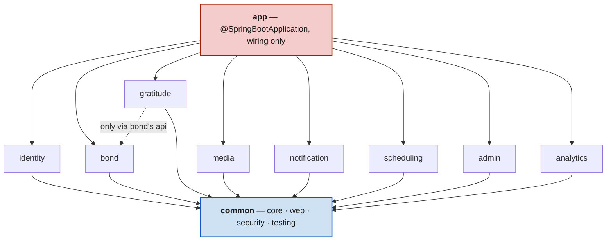
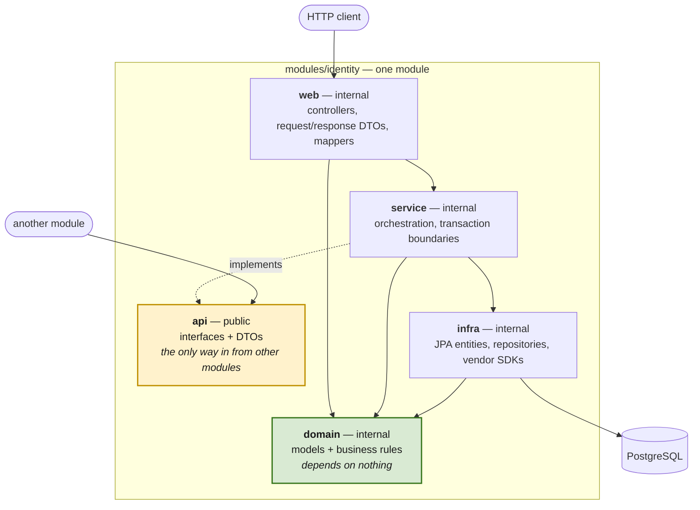

# Moyi Backend

## What is this

The backend for **Moyi** — "Momoyi" in Yoruba, "I know your worth." A
private space for two people, often apart, to each write one thing
they're grateful for about the other, every day. Neither can read the
other's entry until both have written theirs — then both are revealed
together, and a streak tracks the days you both showed up.

One Kotlin/Spring Boot service. Built as a learning project alongside
Philipp Lackner's *Building Industry-Level Kotlin Backends With Spring
Boot* course, deliberately diverging from the course's chat-app shape
wherever this domain — scheduled, timezone-dependent, two-person-private —
actually differs from request/response chat. Every divergence is recorded
as an ADR in [`adr/`](./adr).

## Why it exists

Two reasons, both real: to actually ship a small, correctly-built product
for two people who are far apart, and to learn backend engineering deeply
enough to defend every decision in an interview — not just follow a
tutorial. See `adr/` for the record of what was decided and why, and
`docs/learning-log.md` for the record of what was actually learned
building it.

## How do I run it

**Prerequisites**
- JDK 25 (e.g. via [SDKMAN](https://sdkman.io): `sdk install java 25.0.4-tem`)
- Docker. Colima (`brew install colima docker docker-compose`, then
  `colima start`) works and is what this project is developed against;
  Docker Desktop works too.
  - **Colima only**: Testcontainers (used by the integration tests) needs
    to know where Colima's Docker socket is. Add this to
    `~/.testcontainers.properties` (create it if it doesn't exist),
    replacing the path with your own username:
    ```
    docker.host=unix:///Users/<you>/.colima/default/docker.sock
    ```
    (The other half of this — telling Testcontainers' Ryuk reaper the
    socket path *inside* the Docker host — is already handled in
    `build-logic`'s test configuration and needs no per-developer setup.)

**Running it**
```
docker compose up -d          # Postgres 18 + Redis (Valkey) for local dev
./gradlew bootRun             # starts the app on :8080, profile: default
curl localhost:8080/actuator/health
```
For the app to actually reach the Postgres/Redis started above, run it
with the `local` profile instead: `SPRING_PROFILES_ACTIVE=local ./gradlew bootRun`.

`./gradlew build` runs the full local verification loop: compile, ktlint,
detekt, and tests — including integration tests that spin up a real
Postgres via Testcontainers (needs Docker running).

## How is it structured

A **modular monolith** (ADR-0001): one deployable Spring Boot service,
internally decomposed into Gradle modules with boundaries that are
enforced by tests rather than by good intentions. Microservices would buy
scaling headroom a two-people-per-Bond product will not need for years,
at the cost of distributed transactions and multiplied ops. A ball-of-mud
monolith would teach nothing. This is the middle.

```
moyi-backend/
├─ build-logic/     convention plugins shared across modules
├─ app/             @SpringBootApplication, wiring — depends on everything
├─ common/          core, web, security, testing — shared, no domain logic
├─ modules/         identity, bond, gratitude, media, notification,
│                   scheduling, admin, analytics — the actual domain
├─ contracts/       OpenAPI generation for the client
├─ adr/             architecture decision records
├─ revision/        course-concept notes (what the course taught vs.
│                   what this project does, and why)
└─ docs/            learning log, course workflow, other documentation
```

### How the modules relate

`app` exists only to wire things together. Every domain module may use
`common`, and modules talk to each other **only through another module's
`api` package** — never by reaching into its internals.



That dotted arrow is the one that matters. The reveal gate needs
`gratitude` to ask `bond` "is this person really a member here?"
synchronously, mid-request — so unlike the course (whose modules never
call each other and communicate over RabbitMQ), we do have direct
cross-module calls. They are confined to `api` packages, and everything
else is Kotlin `internal`, so the compiler makes the alternative
impossible rather than merely discouraged.

### Layers inside a single module

Every module in `modules/` is organised the same way. Dependencies point
**inwards**: `domain` sits at the centre and depends on nothing, which is
what lets business rules be tested without Spring, a database or HTTP.



| Layer | Visibility | Holds | May depend on |
|---|---|---|---|
| `api` | **public** | Interfaces and DTOs other modules call | nothing |
| `web` | `internal` | Controllers, HTTP DTOs, mappers | `service`, `domain` |
| `service` | `internal` | Orchestration, transactions | `domain`, `infra`, `api` |
| `infra` | `internal` | JPA entities, repositories, SDKs | `domain` |
| `domain` | `internal` | Models, business rules | nothing |

```
modules/<name>/src/main/kotlin/com/moyi/<name>/
├─ api/                        PUBLIC — the inter-module contract
│  ├─ <Name>Api.kt
│  └─ dto/
├─ web/                        internal — the HTTP edge
│  ├─ controllers/
│  ├─ dto/
│  └─ mappers/
├─ service/                    internal — orchestration
├─ domain/                     internal — innermost
│  ├─ model/
│  └─ exception/
└─ infra/                      internal — technology details
   └─ database/
      ├─ entities/             JPA @Entity, kept out of domain
      ├─ mappers/              entity ↔ domain model
      └─ repositories/
```

Note that JPA entities live in `infra`, **separate from the domain
model**, with mappers between them. It costs a mapping layer and buys a
domain model that owes nothing to Hibernate.

> **A naming note if you are following the course.** Philipp uses `api/`
> for the HTTP layer, because his modules never call each other so the
> name is free. Ours is reserved for the inter-module contract (doc 05
> §2.1), so his `api/` is our `web/`. His modules also share one package
> root across all of them; ours are namespaced `com.moyi.<module>`, which
> avoids split packages and is what makes the rules below expressible.

### The rules are executable

None of the above is guidance. It is enforced in CI by
[`ArchitectureTest.kt`](app/src/test/kotlin/com/moyi/app/ArchitectureTest.kt),
which fails the build on: a layer depending outwards, an `@Entity`
outside `infra`, a controller outside `web`, a public declaration of any
kind outside `api`, `java.util.Date`, or field injection. One further
rule holds the rest up: every file under `modules/` must declare a
`com.moyi.<module>.<layer>` package, because that convention is what all
the others resolve against — a file that breaks it is not rejected by
them, it is invisible to them.

Each rule was verified by writing a real violation and watching it fail,
running the build the ordinary way with no flags — a rule that has never
failed is not yet known to work, and one that never runs cannot fail.

## How is it reviewed

Solo project, so review is automated rather than delegated (doc 18 §11):

- Every change goes through a PR — never a direct push to `main`, which
  is branch-protected and requires the `quality` and `gitleaks` checks.
- The PR template carries a ten-question hostile-reviewer checklist,
  filled in per PR rather than ticked through.
- `.github/workflows/claude-code-review.yml` posts an automated review on
  each non-draft PR when it is opened, reopened, or marked ready. It
  reviews the diff against the Kotlin/Spring conventions, architecture,
  testing strategy, and ADRs. It deliberately does not run on every push:
  the review plugin declines a PR it has already reviewed, so a per-push
  trigger would add no-op runs rather than fresher reviews. Re-run the
  workflow from the Actions tab to review again after pushing fixes.

**One-time setup to activate the automated review.** Both steps are
required — the token alone is not enough. Do only step 2 and every PR
fails with `401 Unauthorized - Claude Code is not installed on this
repository`.

**1. Install the Claude GitHub App** on this repository:
<https://github.com/apps/claude>. This is what grants the workflow
permission to act on the repo; without it the action fails with *"Claude
Code is not installed on this repository."*

**2. Create the auth token and store it as a repository secret:**

```
claude setup-token
gh secret set CLAUDE_CODE_OAUTH_TOKEN --repo Ayodeji97/moyi-backend
```

(Or paste it under Settings → Secrets and variables → Actions → New
repository secret, named `CLAUDE_CODE_OAUTH_TOKEN`.)

Using the OAuth token rather than an `ANTHROPIC_API_KEY` bills against
the Claude subscription instead of separate API credits.

Until the secret exists the job skips with a notice rather than failing.
Once it exists but the app is not installed, the job **fails** — that is
deliberate, because a review that cannot run should be visible rather
than quietly green.

**When the `review` check cannot be trusted.** There is one case that is
neither of the above: `claude-code-action` refuses to run whenever
`claude-code-review.yml` differs from the copy on `main`, and it reports
that refusal as *success*. Any PR that edits the review workflow
therefore gets a green `review` check having reviewed nothing. The job
emits a warning in its summary when it detects this, but the check still
passes — so a workflow change is reviewed by hand, and only proven by
merging it and watching the PR after it.

Note the review posts a single summary comment and a check run; GitHub
has no mechanism to show it as a *requested reviewer*.

## How do I deploy it

Not yet. CI (`.github/workflows/ci.yml`) builds, tests, and — on every
merge to `main` — publishes a container image to GHCR via Spring Boot's
Cloud Native Buildpacks support (`./gradlew bootBuildImage`, no
hand-maintained Dockerfile). There's no deploy stage after that: nothing
pulls the image anywhere yet. Deployment to Hetzner + Kamal + kamal-proxy
is a follow-up plan, once that server infrastructure exists.
