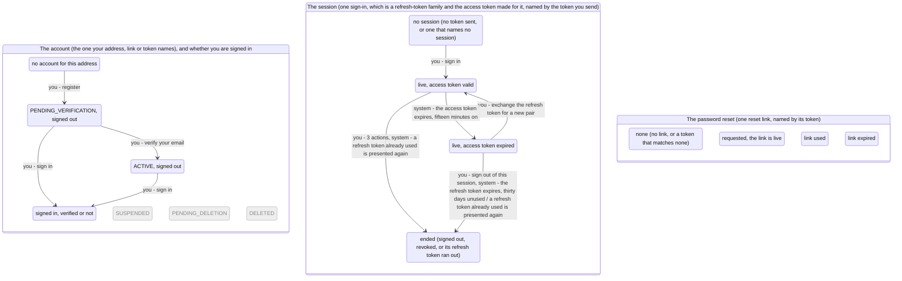

<!-- Generated by scripts/state-map-generate from docs/state-map/data. Do not edit. -->

# The account machine

Describes `main @ 174b474`. How to read this: [README](README.md).

Each arrow says who acts: you, your partner or the system. Refusals are not drawn; they are in the tables below.

## The account (the one your address, link or token names), and whether you are signed in

### Every action in every state

| Action | `ANONYMOUS` | `PENDING_VERIFICATION` | `ACTIVE_SIGNED_OUT` | `SIGNED_IN` |
|---|---|---|---|---|
| register `POST /auth/register` | 201 → `PENDING_VERIFICATION` | 201 stays | 201 stays | 201 stays |
| verify your email `POST /auth/verify-email` | 422 `VERIFICATION_TOKEN_INVALID` | 200 → `ACTIVE_SIGNED_OUT` (the token is one of this account's verification links, under 24 hours old and not yet used) 410 `VERIFICATION_TOKEN_EXPIRED` (the token is one of this account's verification links, more than 24 hours old) 422 `VERIFICATION_TOKEN_INVALID` (the token matches no verification link on record: mistyped, cut short, never issued, or a password-reset token) | 410 `VERIFICATION_TOKEN_EXPIRED` (the token is the link that verified this account, or one of its links that had already passed its 24 hours by then) 422 `VERIFICATION_TOKEN_INVALID` (the token is anything else: a link that was still live when another one verified the account, or a token that matches no verification link) | 200 stays (the token is one of this account's verification links, under 24 hours old and not yet used (so your email is not yet verified)) 410 `VERIFICATION_TOKEN_EXPIRED` (the token is one of this account's verification links that is more than 24 hours old or was already used) 422 `VERIFICATION_TOKEN_INVALID` (the token is anything else: a link deleted when another one verified the account, or a token that matches no verification link) |
| ask for a new verification link `POST /auth/resend-verification` | 202 stays | 202 stays | 202 stays | 202 stays (your email is not verified) 202 stays (your email is verified) |
| sign in `POST /auth/login` | 401 `INVALID_CREDENTIALS` | 200 → `SIGNED_IN` (the account is not locked out and the password is right) 401 `INVALID_CREDENTIALS` (the account is not locked out and the password is wrong) 401 `INVALID_CREDENTIALS` (the account is locked out, whatever the password) | 200 → `SIGNED_IN` (the account is not locked out and the password is right) 401 `INVALID_CREDENTIALS` (the account is not locked out and the password is wrong) 401 `INVALID_CREDENTIALS` (the account is locked out, whatever the password) | 200 stays (the account is not locked out and the password is right) 401 `INVALID_CREDENTIALS` (the account is not locked out and the password is wrong) 401 `INVALID_CREDENTIALS` (the account is locked out, whatever the password) |

### Refused here

| In | Action | Answer | Why | Rule | Evidence |
|---|---|---|---|---|---|
| `ANONYMOUS` | verify your email | 422 `VERIFICATION_TOKEN_INVALID` | With no account there is no link, so whatever is presented matches nothing. The token is looked up by its hash and is never echoed back. | FR-002, ADR-0018 §4 | test |
| `PENDING_VERIFICATION` | verify your email | 410 `VERIFICATION_TOKEN_EXPIRED` | The link was real and its 24 hours have passed. Nothing changes; ask for a new one with resend-verification. (a test asserts the 410 and that nothing changed, not the code) | FR-002, ADR-0018 §4 | never-run |
| `PENDING_VERIFICATION` | verify your email | 422 `VERIFICATION_TOKEN_INVALID` | The lookup is by hash and by purpose, so a token that was never a verification link is not recognised, a reset token included. Nothing changes. | FR-002, ADR-0018 §4 | smoke |
| `ACTIVE_SIGNED_OUT` | verify your email | 410 `VERIFICATION_TOKEN_EXPIRED` | A used link and an expired one get the same answer, because what to do next is the same. An account that is verified is issued no new links, so no live one can exist here. The probe cited presents the used link; that an already expired one still answers 410 afterwards is read from the code, which deletes only the links that were live. | FR-002, ADR-0018 §4 | smoke |
| `ACTIVE_SIGNED_OUT` | verify your email | 422 `VERIFICATION_TOKEN_INVALID` | The other links that were live at the moment of verifying were deleted, so one of them is now simply not recognised. Nothing changes. (a test asserts the 422 for a retired link, not the code) | FR-002, ADR-0018 §6 | never-run |
| `SIGNED_IN` | verify your email | 410 `VERIFICATION_TOKEN_EXPIRED` | The same answer as when signed out: verifying reads no access token. Nothing changes. | FR-002, ADR-0018 §4 | never-run |
| `SIGNED_IN` | verify your email | 422 `VERIFICATION_TOKEN_INVALID` | The same answer as when signed out: verifying reads no access token. Nothing changes. | FR-002, ADR-0018 §4 | never-run |
| `ANONYMOUS` | sign in | 401 `INVALID_CREDENTIALS` | No account has this address. The answer is the same 401 with the same body as a wrong password, and a password check against a fixed dummy hash is still paid for so that it takes as long. An address that is not even shaped like one gets this answer too, not a 422. | FR-003, ADR-0020 §1 | smoke |
| `PENDING_VERIFICATION` | sign in | 401 `INVALID_CREDENTIALS` | One refusal covers a wrong password, an unknown address and a locked account, with a byte-identical body and no WWW-Authenticate, so that the answer does not say which it was. The failure is counted: the fifth in a row locks the account for one minute, and each failure after a lock has run out doubles the next lock, up to one hour. | FR-003, ADR-0020 §1, §4 | never-run |
| `PENDING_VERIFICATION` | sign in | 401 `INVALID_CREDENTIALS` | While locked, the right password is refused with the same 401 and the same body as a wrong one, and the caller is deliberately not told the account is locked: only a real account can be locked, so saying so would confirm the address. The password is still checked and the result thrown away; the attempt is not counted, so a lock cannot be made longer by retrying. The lock ends by itself, and a password reset clears it. | ADR-0020 §4 | never-run |
| `ACTIVE_SIGNED_OUT` | sign in | 401 `INVALID_CREDENTIALS` | One refusal covers a wrong password, an unknown address and a locked account, with a byte-identical body and no WWW-Authenticate, so that the answer does not say which it was. The failure is counted: the fifth in a row locks the account for one minute, and each failure after a lock has run out doubles the next lock, up to one hour. | FR-003, ADR-0020 §1, §4 | test |
| `ACTIVE_SIGNED_OUT` | sign in | 401 `INVALID_CREDENTIALS` | While locked, the right password is refused with the same 401 and the same body as a wrong one, and the caller is deliberately not told the account is locked: only a real account can be locked, so saying so would confirm the address. The password is still checked and the result thrown away; the attempt is not counted, so a lock cannot be made longer by retrying. The lock ends by itself, and a password reset clears it. | ADR-0020 §4 | test |
| `SIGNED_IN` | sign in | 401 `INVALID_CREDENTIALS` | One refusal covers a wrong password, an unknown address and a locked account, with a byte-identical body and no WWW-Authenticate, so that the answer does not say which it was. The failure is counted: the fifth in a row locks the account for one minute, and each failure after a lock has run out doubles the next lock, up to one hour. The session you already hold is not affected by a failed sign-in. | FR-003, ADR-0020 §1, §4 | smoke |
| `SIGNED_IN` | sign in | 401 `INVALID_CREDENTIALS` | While locked, the right password is refused with the same 401 and the same body as a wrong one, and the caller is deliberately not told the account is locked: only a real account can be locked, so saying so would confirm the address. The password is still checked and the result thrown away; the attempt is not counted, so a lock cannot be made longer by retrying. The lock ends by itself, and a password reset clears it. The session you already hold keeps working: a lock stops new sign-ins only. | ADR-0020 §4 | smoke |

### Happens without you

| In | What happens | Who | Leads to | Why | Evidence |
|---|---|---|---|---|---|
| `PENDING_VERIFICATION` | the verification link expires, a day on | system | `PENDING_VERIFICATION` | A verification link stops working 24 hours after it was issued. No job does this and nothing is written: every presentation compares the link's expiry with the clock. The account stays as it is, and a new link can be asked for. The test cited moves the expiry into the past and finds the link refused and the account unchanged; the 24 hours are read from the code. | test |

## The session (one sign-in, which is a refresh-token family and the access token made for it, named by the token you send)

### Every action in every state

| Action | `NO_SESSION` | `ACCESS_VALID` | `ACCESS_EXPIRED` | `ENDED` |
|---|---|---|---|---|
| sign in `POST /auth/login` | 200 → `ACCESS_VALID` (the sign-in is accepted (the account says when)) 401 `INVALID_CREDENTIALS` (the sign-in is refused) | 200 stays (the sign-in is accepted (the account says when)) 401 `INVALID_CREDENTIALS` (the sign-in is refused) | 200 stays (the sign-in is accepted (the account says when)) 401 `INVALID_CREDENTIALS` (the sign-in is refused) | 200 stays (the sign-in is accepted (the account says when)) 401 `INVALID_CREDENTIALS` (the sign-in is refused) |
| exchange the refresh token for a new pair `POST /auth/refresh` | 401 `REFRESH_TOKEN_INVALID` | 200 stays (you send the session's current refresh token) 401 `TOKEN_REUSE_DETECTED` (you send a refresh token of this session that was already exchanged for a newer one) | 200 → `ACCESS_VALID` (you send the session's current refresh token) 401 `TOKEN_REUSE_DETECTED` (you send a refresh token of this session that was already exchanged for a newer one) | 401 `REFRESH_TOKEN_INVALID` (the session was revoked: by logout, by being removed from the sessions list, by logout-all, by a password reset, or by an earlier reuse) 401 `REFRESH_TOKEN_INVALID` (the session ran out, and you send its last refresh token, now more than 30 days old) 401 `TOKEN_REUSE_DETECTED` (the session ran out, and you send an older refresh token of it that had been exchanged) |
| sign out of this session `POST /auth/logout` | 204 stays | 204 → `ENDED` | 204 → `ENDED` | 204 stays |
| sign out everywhere `POST /auth/logout-all` | 401 `UNAUTHENTICATED` | 204 → `ENDED` | 401 `UNAUTHENTICATED` | 204 stays (its access token is still accepted: the session ended by logout, by being removed from the sessions list or by a reuse, and the token is under 15 minutes old) 401 `UNAUTHENTICATED` (its access token is no longer accepted: logout-all or a password reset ended it, or the token is past its 15 minutes) |
| read your profile `GET /me` | 401 `UNAUTHENTICATED` | 200 stays | 401 `UNAUTHENTICATED` | 200 stays (its access token is still accepted: the session ended by logout, by being removed from the sessions list or by a reuse, and the token is under 15 minutes old) 401 `UNAUTHENTICATED` (its access token is no longer accepted: logout-all or a password reset ended it, or the token is past its 15 minutes) |
| list your sessions `GET /auth/sessions` | 401 `UNAUTHENTICATED` | 200 stays | 401 `UNAUTHENTICATED` | 200 stays (its access token is still accepted: the session ended by logout, by being removed from the sessions list or by a reuse, and the token is under 15 minutes old) 401 `UNAUTHENTICATED` (its access token is no longer accepted: logout-all or a password reset ended it, or the token is past its 15 minutes) |
| end one session `DELETE /auth/sessions/{id}` | 401 `UNAUTHENTICATED` | 204 → `ENDED` (the id is this session's) 204 stays (the id is another live session of yours) 404 `NOT_FOUND` (the id is anything else: not a UUID, somebody else's session, one that never existed, or one already ended or expired) | 401 `UNAUTHENTICATED` | 204 stays (its access token is still accepted, and the id is another live session of yours) 404 `NOT_FOUND` (its access token is still accepted, and the id is anything else, this session's own included) 401 `UNAUTHENTICATED` (its access token is no longer accepted: logout-all or a password reset ended it, or the token is past its 15 minutes) |

### Refused here

| In | Action | Answer | Why | Rule | Evidence |
|---|---|---|---|---|---|
| `NO_SESSION` | sign in | 401 `INVALID_CREDENTIALS` | A wrong password, an unknown address and a locked account are one answer. No session begins and no token is issued. | FR-003, ADR-0020 §1 | test |
| `ACCESS_VALID` | sign in | 401 `INVALID_CREDENTIALS` | A refused sign-in issues nothing and does not touch the session you hold. | FR-003, ADR-0020 §1 | smoke |
| `ACCESS_EXPIRED` | sign in | 401 `INVALID_CREDENTIALS` | A refused sign-in issues nothing and does not touch the session you hold. | FR-003, ADR-0020 §1 | never-run |
| `ENDED` | sign in | 401 `INVALID_CREDENTIALS` | A refused sign-in issues nothing. | FR-003, ADR-0020 §1 | never-run |
| `NO_SESSION` | exchange the refresh token for a new pair | 401 `REFRESH_TOKEN_INVALID` | The refresh token matches none on record. Refresh takes no access token: the refresh token is the credential. Sign in again. | ADR-0021 §2 | smoke |
| `ACCESS_VALID` | exchange the refresh token for a new pair | 401 `TOKEN_REUSE_DETECTED` | An exchanged token coming back means a copy exists: either a thief or the owner is holding a stale one, and the server cannot tell which. The request is refused, and as a consequence the whole session is ended (see what happens without you) and the account's address is emailed. There is no grace period: two refreshes of one token at the same moment let one through and treat the other as this. | ADR-0021 §2, §3 | smoke |
| `ACCESS_EXPIRED` | exchange the refresh token for a new pair | 401 `TOKEN_REUSE_DETECTED` | An exchanged token coming back means a copy exists: either a thief or the owner is holding a stale one, and the server cannot tell which. The request is refused, and as a consequence the whole session is ended (see what happens without you) and the account's address is emailed. There is no grace period: two refreshes of one token at the same moment let one through and treat the other as this. | ADR-0021 §2, §3 | never-run |
| `ENDED` | exchange the refresh token for a new pair | 401 `REFRESH_TOKEN_INVALID` | Any refresh token of a revoked session, the newest or an older one, gets this answer. Revocation is checked before reuse, so presenting a stale token a second time is not a second reuse and sends no second email. Sign in again. | ADR-0021 §2 | smoke |
| `ENDED` | exchange the refresh token for a new pair | 401 `REFRESH_TOKEN_INVALID` | An expired refresh token is not a reuse: nothing is revoked and nobody is emailed. Sign in again. | ADR-0021 §2 | test |
| `ENDED` | exchange the refresh token for a new pair | 401 `TOKEN_REUSE_DETECTED` | Reuse is checked before expiry, so an exchanged token is a reuse even when the session it belonged to has since run out: the family is marked revoked and the address is emailed. The session was already over. | ADR-0021 §2 | never-run |
| `NO_SESSION` | sign out everywhere | 401 `UNAUTHENTICATED` | No access token is sent, or one that names no session, so there is nobody to act for. Sign in first. | ADR-0019 §5 | smoke |
| `ACCESS_EXPIRED` | sign out everywhere | 401 `UNAUTHENTICATED` | The access token is past its 15 minutes (the server allows 60 seconds for a wrong clock). Exchange the refresh token at POST /auth/refresh, then repeat the call. (a test asserts the 401 for an expired token on a test-only route, not the code) | ADR-0019 §5 | never-run |
| `ENDED` | sign out everywhere | 401 `UNAUTHENTICATED` | Nothing is left that the server accepts. Sign in again. | ADR-0019 §4 | never-run |
| `NO_SESSION` | read your profile | 401 `UNAUTHENTICATED` | No access token is sent, or one that names no session, so there is nobody to act for. Sign in first. | ADR-0019 §5 | smoke |
| `ACCESS_EXPIRED` | read your profile | 401 `UNAUTHENTICATED` | The access token is past its 15 minutes (the server allows 60 seconds for a wrong clock). Exchange the refresh token at POST /auth/refresh, then repeat the call. (a test asserts the 401 for an expired token on a test-only route, not the code) | ADR-0019 §5 | never-run |
| `ENDED` | read your profile | 401 `UNAUTHENTICATED` | After logout-all or a password reset, a token issued before that second is refused whatever its remaining life. The test cited sets the account's sign-out time directly, as those two do, and finds a token issued earlier refused; LoginEndpointTest shows the same 401 after a real logout-all and a real reset, by status. | ADR-0019 §4 | test |
| `NO_SESSION` | list your sessions | 401 `UNAUTHENTICATED` | No access token is sent, or one that names no session, so there is nobody to act for. Sign in first. | ADR-0019 §5 | smoke |
| `ACCESS_EXPIRED` | list your sessions | 401 `UNAUTHENTICATED` | The access token is past its 15 minutes (the server allows 60 seconds for a wrong clock). Exchange the refresh token at POST /auth/refresh, then repeat the call. (a test asserts the 401 for an expired token on a test-only route, not the code) | ADR-0019 §5 | never-run |
| `ENDED` | list your sessions | 401 `UNAUTHENTICATED` | Nothing is left that the server accepts. Sign in again. | ADR-0019 §4 | never-run |
| `NO_SESSION` | end one session | 401 `UNAUTHENTICATED` | No access token is sent, or one that names no session, so there is nobody to act for. Sign in first. (a test asserts the 401 for a call with no token, not the code) | ADR-0019 §5 | never-run |
| `ACCESS_VALID` | end one session | 404 `NOT_FOUND` | All of these get one answer, and never 403, so that it does not confirm an id exists. The id you own is the only thing checked: the update that ends a session names both the session and you. | FR-007, ADR-0025 §5 | smoke |
| `ACCESS_EXPIRED` | end one session | 401 `UNAUTHENTICATED` | The access token is past its 15 minutes (the server allows 60 seconds for a wrong clock). Exchange the refresh token at POST /auth/refresh, then repeat the call. (a test asserts the 401 for an expired token on a test-only route, not the code) | ADR-0019 §5 | never-run |
| `ENDED` | end one session | 404 `NOT_FOUND` | A session that has ended is not found, so ending it twice is 404 the second time, the same answer as for an id that is not yours. (a test asserts the 404 for ending the same session twice, not the code) | FR-007, ADR-0025 §5 | never-run |
| `ENDED` | end one session | 401 `UNAUTHENTICATED` | Nothing is left that the server accepts. Sign in again. | ADR-0019 §4 | never-run |

### Happens without you

| In | What happens | Who | Leads to | Why | Evidence |
|---|---|---|---|---|---|
| `ACCESS_VALID` | the access token expires, fifteen minutes on | system | `ACCESS_EXPIRED` | Fifteen minutes after it was issued the access token is refused; the server allows 60 seconds more for a clock that is wrong. No job does this: the token carries its own expiry and each request compares it with the clock. The session itself is still live and its refresh token still works. The test cited presents a token two minutes past its expiry and finds it refused; the fifteen minutes are read from the code, and a sign-in answers expiresIn 900. | test |
| `ACCESS_EXPIRED` | the refresh token expires, thirty days unused | system | `ENDED` | A refresh token lasts 30 days from the sign-in or refresh that issued it. Left unused that long, it can no longer be exchanged and the session is over: it leaves the sessions list and cannot be ended by id. Nothing is written and nothing is revoked; each use compares the expiry with the clock. It cannot happen while the access token is valid, since both tokens are issued together. The test cited moves the clock 31 days on; the thirty days are read from the code. | test |
| `ACCESS_VALID` | a refresh token already used is presented again | system | `ENDED` | A refresh token of this session that had already been exchanged is presented again, by you or by someone holding a copy. Every refresh token of the session's family is revoked, the newest included, though it was never misused, and the account's address is emailed. Only this session ends: the account's other sessions are untouched, and this session's access token is accepted until its 15 minutes run out. | test |
| `ACCESS_EXPIRED` | a refresh token already used is presented again | system | `ENDED` | A refresh token of this session that had already been exchanged is presented again. Every refresh token of the session's family is revoked, the newest included, and the account's address is emailed. Only this session ends. | never-run |

## Where the contract is silent

The code answers these and `contracts/openapi.json` does not document them.

| Endpoint | Status | What the code does |
|---|---|---|
| `POST /auth/register` | 503 | 503 HASHING_CAPACITY_EXCEEDED with Retry-After: 1 when password hashing is full. The contract's generator (OpenApiConfiguration.statusesFor) gives a public auth route no 401 and adds 410 and 503 to nothing. |
| `POST /auth/register` | 415 | A Content-Type other than application/json is 415 UNSUPPORTED_MEDIA_TYPE; the contract's generator adds 415 only to the two Idempotency-Key routes. |
| `POST /auth/verify-email` | 410 | 410 VERIFICATION_TOKEN_EXPIRED for a verification link that is past its 24 hours or was already used. The contract's generator (OpenApiConfiguration.statusesFor) gives a public auth route no 401 and adds 410 and 503 to nothing. |
| `POST /auth/verify-email` | 415 | A Content-Type other than application/json is 415 UNSUPPORTED_MEDIA_TYPE; the contract's generator adds 415 only to the two Idempotency-Key routes. |
| `POST /auth/resend-verification` | 415 | A Content-Type other than application/json is 415 UNSUPPORTED_MEDIA_TYPE; the contract's generator adds 415 only to the two Idempotency-Key routes. |
| `POST /auth/login` | 401 | 401 INVALID_CREDENTIALS for every refused sign-in: a wrong password, an unknown address, a locked account. The contract's generator (OpenApiConfiguration.statusesFor) gives a public auth route no 401 and adds 410 and 503 to nothing. |
| `POST /auth/login` | 503 | 503 HASHING_CAPACITY_EXCEEDED with Retry-After: 1 when password hashing is full; sign-in checks the password under the same limit as registration. The contract's generator (OpenApiConfiguration.statusesFor) gives a public auth route no 401 and adds 410 and 503 to nothing. |
| `POST /auth/login` | 415 | A Content-Type other than application/json is 415 UNSUPPORTED_MEDIA_TYPE; the contract's generator adds 415 only to the two Idempotency-Key routes. |
| `POST /auth/refresh` | 401 | 401 REFRESH_TOKEN_INVALID for a refresh token that is unknown, expired or revoked, and 401 TOKEN_REUSE_DETECTED for one already exchanged. The contract's generator (OpenApiConfiguration.statusesFor) gives a public auth route no 401 and adds 410 and 503 to nothing. |
| `POST /auth/refresh` | 415 | A Content-Type other than application/json is 415 UNSUPPORTED_MEDIA_TYPE; the contract's generator adds 415 only to the two Idempotency-Key routes. |
| `POST /auth/logout` | 415 | A Content-Type other than application/json is 415 UNSUPPORTED_MEDIA_TYPE; the contract's generator adds 415 only to the two Idempotency-Key routes. |
