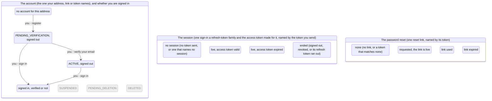

<!-- Generated by scripts/state-map-generate from docs/state-map/data. Do not edit. -->

# The account machine

Describes `main @ 174b474`. How to read this: [README](README.md).

Each arrow says who acts: you, your partner or the system. Refusals are not drawn; they are in the tables below.

## The account (the one your address, link or token names), and whether you are signed in

### Every action in every state

| Action | `ANONYMOUS` | `PENDING_VERIFICATION` | `ACTIVE_SIGNED_OUT` | `SIGNED_IN` |
|---|---|---|---|---|
| register `POST /auth/register` | 201 → `PENDING_VERIFICATION` | 201 stays | 201 stays | 201 stays |
| verify your email `POST /auth/verify-email` | 422 `VERIFICATION_TOKEN_INVALID` | 200 → `ACTIVE_SIGNED_OUT` (the token is one of this account's verification links, under 24 hours old and not yet used) 410 `VERIFICATION_TOKEN_EXPIRED` (the token is one of this account's verification links, more than 24 hours old) 422 `VERIFICATION_TOKEN_INVALID` (the token matches no verification link on record: mistyped, cut short, never issued, or a password-reset token) | 410 `VERIFICATION_TOKEN_EXPIRED` (the token is the link that verified this account, or one of its links that had already passed its 24 hours by then) 422 `VERIFICATION_TOKEN_INVALID` (the token is anything else: a link that was still live when another one verified the account, or a token that matches no verification link) | 200 stays (the token is one of this account's verification links, under 24 hours old and not yet used (so your email is not yet verified)) 410 `VERIFICATION_TOKEN_EXPIRED` (the token is one of this account's verification links that is more than 24 hours old or was already used) 422 `VERIFICATION_TOKEN_INVALID` (the token is anything else: a link deleted when another one verified the account, or a token that matches no verification link) |
| ask for a new verification link `POST /auth/resend-verification` | 202 stays | 202 stays | 202 stays | 202 stays (your email is not verified) 202 stays (your email is verified) |
| sign in `POST /auth/login` | 401 `INVALID_CREDENTIALS` | 200 → `SIGNED_IN` (the account is not locked out and the password is right) 401 `INVALID_CREDENTIALS` (the account is not locked out and the password is wrong) 401 `INVALID_CREDENTIALS` (the account is locked out, whatever the password) | 200 → `SIGNED_IN` (the account is not locked out and the password is right) 401 `INVALID_CREDENTIALS` (the account is not locked out and the password is wrong) 401 `INVALID_CREDENTIALS` (the account is locked out, whatever the password) | 200 stays (the account is not locked out and the password is right) 401 `INVALID_CREDENTIALS` (the account is not locked out and the password is wrong) 401 `INVALID_CREDENTIALS` (the account is locked out, whatever the password) |

### Refused here

| In | Action | Answer | Why | Rule | Evidence |
|---|---|---|---|---|---|
| `ANONYMOUS` | verify your email | 422 `VERIFICATION_TOKEN_INVALID` | With no account there is no link, so whatever is presented matches nothing. The token is looked up by its hash and is never echoed back. | FR-002, ADR-0018 §4 | test |
| `PENDING_VERIFICATION` | verify your email | 410 `VERIFICATION_TOKEN_EXPIRED` | The link was real and its 24 hours have passed. Nothing changes; ask for a new one with resend-verification. (a test asserts the 410 and that nothing changed, not the code) | FR-002, ADR-0018 §4 | never-run |
| `PENDING_VERIFICATION` | verify your email | 422 `VERIFICATION_TOKEN_INVALID` | The lookup is by hash and by purpose, so a token that was never a verification link is not recognised, a reset token included. Nothing changes. | FR-002, ADR-0018 §4 | smoke |
| `ACTIVE_SIGNED_OUT` | verify your email | 410 `VERIFICATION_TOKEN_EXPIRED` | A used link and an expired one get the same answer, because what to do next is the same. An account that is verified is issued no new links, so no live one can exist here. The probe cited presents the used link; that an already expired one still answers 410 afterwards is read from the code, which deletes only the links that were live. | FR-002, ADR-0018 §4 | smoke |
| `ACTIVE_SIGNED_OUT` | verify your email | 422 `VERIFICATION_TOKEN_INVALID` | The other links that were live at the moment of verifying were deleted, so one of them is now simply not recognised. Nothing changes. (a test asserts the 422 for a retired link, not the code) | FR-002, ADR-0018 §6 | never-run |
| `SIGNED_IN` | verify your email | 410 `VERIFICATION_TOKEN_EXPIRED` | The same answer as when signed out: verifying reads no access token. Nothing changes. | FR-002, ADR-0018 §4 | never-run |
| `SIGNED_IN` | verify your email | 422 `VERIFICATION_TOKEN_INVALID` | The same answer as when signed out: verifying reads no access token. Nothing changes. | FR-002, ADR-0018 §4 | never-run |
| `ANONYMOUS` | sign in | 401 `INVALID_CREDENTIALS` | No account has this address. The answer is the same 401 with the same body as a wrong password, and a password check against a fixed dummy hash is still paid for so that it takes as long. An address that is not even shaped like one gets this answer too, not a 422. | FR-003, ADR-0020 §1 | smoke |
| `PENDING_VERIFICATION` | sign in | 401 `INVALID_CREDENTIALS` | One refusal covers a wrong password, an unknown address and a locked account, with a byte-identical body and no WWW-Authenticate, so that the answer does not say which it was. The failure is counted: the fifth in a row locks the account for one minute, and each failure after a lock has run out doubles the next lock, up to one hour. | FR-003, ADR-0020 §1, §4 | never-run |
| `PENDING_VERIFICATION` | sign in | 401 `INVALID_CREDENTIALS` | While locked, the right password is refused with the same 401 and the same body as a wrong one, and the caller is deliberately not told the account is locked: only a real account can be locked, so saying so would confirm the address. The password is still checked and the result thrown away; the attempt is not counted, so a lock cannot be made longer by retrying. The lock ends by itself, and a password reset clears it. | ADR-0020 §4 | never-run |
| `ACTIVE_SIGNED_OUT` | sign in | 401 `INVALID_CREDENTIALS` | One refusal covers a wrong password, an unknown address and a locked account, with a byte-identical body and no WWW-Authenticate, so that the answer does not say which it was. The failure is counted: the fifth in a row locks the account for one minute, and each failure after a lock has run out doubles the next lock, up to one hour. | FR-003, ADR-0020 §1, §4 | test |
| `ACTIVE_SIGNED_OUT` | sign in | 401 `INVALID_CREDENTIALS` | While locked, the right password is refused with the same 401 and the same body as a wrong one, and the caller is deliberately not told the account is locked: only a real account can be locked, so saying so would confirm the address. The password is still checked and the result thrown away; the attempt is not counted, so a lock cannot be made longer by retrying. The lock ends by itself, and a password reset clears it. | ADR-0020 §4 | test |
| `SIGNED_IN` | sign in | 401 `INVALID_CREDENTIALS` | One refusal covers a wrong password, an unknown address and a locked account, with a byte-identical body and no WWW-Authenticate, so that the answer does not say which it was. The failure is counted: the fifth in a row locks the account for one minute, and each failure after a lock has run out doubles the next lock, up to one hour. The session you already hold is not affected by a failed sign-in. | FR-003, ADR-0020 §1, §4 | smoke |
| `SIGNED_IN` | sign in | 401 `INVALID_CREDENTIALS` | While locked, the right password is refused with the same 401 and the same body as a wrong one, and the caller is deliberately not told the account is locked: only a real account can be locked, so saying so would confirm the address. The password is still checked and the result thrown away; the attempt is not counted, so a lock cannot be made longer by retrying. The lock ends by itself, and a password reset clears it. The session you already hold keeps working: a lock stops new sign-ins only. | ADR-0020 §4 | smoke |

### Happens without you

| In | What happens | Who | Leads to | Why | Evidence |
|---|---|---|---|---|---|
| `PENDING_VERIFICATION` | the verification link expires, a day on | system | `PENDING_VERIFICATION` | A verification link stops working 24 hours after it was issued. No job does this and nothing is written: every presentation compares the link's expiry with the clock. The account stays as it is, and a new link can be asked for. The test cited moves the expiry into the past and finds the link refused and the account unchanged; the 24 hours are read from the code. | test |

## Where the contract is silent

The code answers these and `contracts/openapi.json` does not document them.

| Endpoint | Status | What the code does |
|---|---|---|
| `POST /auth/register` | 503 | 503 HASHING_CAPACITY_EXCEEDED with Retry-After: 1 when password hashing is full. The contract's generator (OpenApiConfiguration.statusesFor) gives a public auth route no 401 and adds 410 and 503 to nothing. |
| `POST /auth/register` | 415 | A Content-Type other than application/json is 415 UNSUPPORTED_MEDIA_TYPE; the contract's generator adds 415 only to the two Idempotency-Key routes. |
| `POST /auth/verify-email` | 410 | 410 VERIFICATION_TOKEN_EXPIRED for a verification link that is past its 24 hours or was already used. The contract's generator (OpenApiConfiguration.statusesFor) gives a public auth route no 401 and adds 410 and 503 to nothing. |
| `POST /auth/verify-email` | 415 | A Content-Type other than application/json is 415 UNSUPPORTED_MEDIA_TYPE; the contract's generator adds 415 only to the two Idempotency-Key routes. |
| `POST /auth/resend-verification` | 415 | A Content-Type other than application/json is 415 UNSUPPORTED_MEDIA_TYPE; the contract's generator adds 415 only to the two Idempotency-Key routes. |
| `POST /auth/login` | 401 | 401 INVALID_CREDENTIALS for every refused sign-in: a wrong password, an unknown address, a locked account. The contract's generator (OpenApiConfiguration.statusesFor) gives a public auth route no 401 and adds 410 and 503 to nothing. |
| `POST /auth/login` | 503 | 503 HASHING_CAPACITY_EXCEEDED with Retry-After: 1 when password hashing is full; sign-in checks the password under the same limit as registration. The contract's generator (OpenApiConfiguration.statusesFor) gives a public auth route no 401 and adds 410 and 503 to nothing. |
| `POST /auth/login` | 415 | A Content-Type other than application/json is 415 UNSUPPORTED_MEDIA_TYPE; the contract's generator adds 415 only to the two Idempotency-Key routes. |
