<!-- Generated by scripts/state-map-generate from docs/state-map/data. Do not edit. -->

# The bond machine

Describes `main @ 174b474`. How to read this: [README](README.md).

```mermaid
stateDiagram-v2
    state "The bond" as bond {
        state "no bond" as bond__NO_BOND
        state "PENDING_MEMBER" as bond__PENDING_MEMBER
        state "ACTIVE" as bond__ACTIVE
        state "PENDING_DELETION" as bond__PENDING_DELETION
        state "ARCHIVED" as bond__ARCHIVED
        state "DELETED" as bond__DELETED
        bond__NO_BOND --> bond__PENDING_MEMBER: you - create a bond
        bond__PENDING_MEMBER --> bond__ARCHIVED: you - leave the bond / block your partner
        bond__ACTIVE --> bond__ARCHIVED: you - leave the bond / block your partner, partner - your partner leaves / your partner blocks you
        bond__NO_BOND --> bond__ACTIVE: you - accept an invite
        bond__PENDING_MEMBER --> bond__PENDING_DELETION: you - ask for the bond's deletion, or agree to it
        bond__ACTIVE --> bond__PENDING_DELETION: you - ask for the bond's deletion, or agree to it, partner - your partner agrees to your proposal
        bond__PENDING_DELETION --> bond__ACTIVE: you - call off the deletion, partner - your partner calls a proposal or the deletion off
        bond__PENDING_DELETION --> bond__ARCHIVED: you - call off the deletion, partner - your partner calls a proposal or the deletion off
        bond__PENDING_DELETION --> bond__PENDING_MEMBER: you - call off the deletion
        bond__PENDING_MEMBER --> bond__ACTIVE: partner - your partner accepts the invite
    }
    state "The invite (one invite, named by its code)" as bond_invite {
        state "none (a code never issued, or an invite not yet made)" as bond_invite__NONE
        state "live" as bond_invite__CREATED
        state "accepted" as bond_invite__ACCEPTED
        state "revoked" as bond_invite__REVOKED
        state "expired (answered in every cell exactly as revoked is, and reached differently)" as bond_invite__EXPIRED
        bond_invite__NONE --> bond_invite__CREATED: you - create a bond / issue a new invite
        bond_invite__CREATED --> bond_invite__REVOKED: you - 5 actions
        bond_invite__CREATED --> bond_invite__ACCEPTED: you - accept an invite, partner - your partner accepts the invite
        bond_invite__CREATED --> bond_invite__EXPIRED: system - the invite expires, seven days on
    }
    state "The proposal (the latest of the kind the endpoint works on, the zone change or the deletion)" as bond_proposal {
        state "none" as bond_proposal__NONE
        state "waiting for the other member" as bond_proposal__PROPOSED
        state "confirmed" as bond_proposal__CONFIRMED
        state "cancelled" as bond_proposal__CANCELLED
        state "lapsed, unanswered" as bond_proposal__LAPSED
        bond_proposal__NONE --> bond_proposal__PROPOSED: you - propose a new time zone / ask for the bond's deletion, or agree to it, partner - your partner proposes a change
        bond_proposal__CONFIRMED --> bond_proposal__PROPOSED: you - propose a new time zone / ask for the bond's deletion, or agree to it, partner - your partner proposes a change
        bond_proposal__CANCELLED --> bond_proposal__PROPOSED: you - propose a new time zone / ask for the bond's deletion, or agree to it, partner - your partner proposes a change
        bond_proposal__LAPSED --> bond_proposal__PROPOSED: you - propose a new time zone / ask for the bond's deletion, or agree to it, partner - your partner proposes a change
        bond_proposal__PROPOSED --> bond_proposal__CONFIRMED: you - agree to the time zone change / ask for the bond's deletion, or agree to it, partner - your partner agrees to your proposal
        bond_proposal__PROPOSED --> bond_proposal__CANCELLED: you - 4 actions, partner - 3 actions
        bond_proposal__NONE --> bond_proposal__CONFIRMED: you - ask for the bond's deletion, or agree to it
        bond_proposal__LAPSED --> bond_proposal__CANCELLED: you - leave the bond / block your partner, partner - your partner leaves / your partner blocks you
        bond_proposal__PROPOSED --> bond_proposal__LAPSED: system - the proposal lapses, seven days unanswered
    }
    classDef unbuilt fill:#eeeeee,stroke:#aaaaaa,color:#888888
    class bond__DELETED unbuilt
```

Each arrow says who acts: you, your partner or the system. Refusals are not drawn; they are in the tables below.

## The bond

### Every action in every state

| Action | `NO_BOND` | `PENDING_MEMBER` | `ACTIVE` | `PENDING_DELETION` | `ARCHIVED` |
|---|---|---|---|---|---|
| list your bonds `GET /bonds` | 200 stays | 200 stays | 200 stays | 200 stays | 200 stays |
| create a bond `POST /bonds` | 201 → `PENDING_MEMBER` (your email is verified, and you are in fewer than three bonds that are open or counting down to deletion) 403 `EMAIL_NOT_VERIFIED` (your email is not verified) 409 `BOND_LIMIT_REACHED` (your email is verified, and you are already in three bonds that are open or counting down to deletion) | 201 stays (you are in fewer than three bonds that are open or counting down to deletion) 409 `BOND_LIMIT_REACHED` (you are already in three bonds that are open or counting down to deletion) | 201 stays (you are in fewer than three bonds that are open or counting down to deletion) 409 `BOND_LIMIT_REACHED` (you are already in three bonds that are open or counting down to deletion) | 201 stays (you are in fewer than three bonds that are open or counting down to deletion) 409 `BOND_LIMIT_REACHED` (you are already in three bonds that are open or counting down to deletion) | 201 stays (you are in fewer than three bonds that are open or counting down to deletion) 409 `BOND_LIMIT_REACHED` (you are already in three bonds that are open or counting down to deletion) |
| read a bond `GET /bonds/{bondId}` | 404 `NOT_FOUND` | 200 stays | 200 stays | 200 stays | 200 stays |
| change the bond's settings `PATCH /bonds/{bondId}` | 404 `NOT_FOUND` | 200 stays | 200 stays | 409 `BOND_ARCHIVED` | 409 `BOND_ARCHIVED` |
| leave the bond `POST /bonds/{bondId}/leave` | 404 `NOT_FOUND` | 204 → `ARCHIVED` | 204 → `ARCHIVED` | 204 stays (you are still in the bond) 204 stays (you have already left it, and it is still counting down) | 409 `BOND_ARCHIVED` |
| block your partner `POST /bonds/{bondId}/block` | 404 `NOT_FOUND` | 204 → `ARCHIVED` | 204 → `ARCHIVED` | 204 stays (you are still in the bond) 204 stays (you have already left it, and it is still counting down) | 204 stays |
| issue a new invite `POST /bonds/{bondId}/invites` | 404 `NOT_FOUND` | 201 stays | 409 `BOND_FULL` | 409 `BOND_ARCHIVED` | 409 `BOND_ARCHIVED` |
| revoke an invite `DELETE /bonds/{bondId}/invites/{inviteId}` | 404 `NOT_FOUND` | 204 stays (the id is this bond's live invite) 404 `NOT_FOUND` (the id is not this bond's live invite) | 404 `NOT_FOUND` | 404 `NOT_FOUND` (the invite id is not a UUID) 409 `BOND_ARCHIVED` (the invite id is a UUID) | 404 `NOT_FOUND` (the invite id is not a UUID) 409 `BOND_ARCHIVED` (the invite id is a UUID) |
| accept an invite `POST /invites/{code}/accept` | 200 → `ACTIVE` (your email is verified, the code is live, you are in fewer than three bonds that are open or counting down, its bond still waits for its second member, and neither of you has blocked the other) 403 `EMAIL_NOT_VERIFIED` (your email is not verified) 409 `BOND_LIMIT_REACHED` (your email is verified, the code is live, and you are already in three bonds that are open or counting down) 404 `INVITE_NOT_USABLE` (your email is verified, and the code is not live; or it is live, you are under the limit, and either its bond has no seat or one of you has blocked the other) | 409 `ALREADY_MEMBER` (the code is this bond's live invite) 404 `INVITE_NOT_USABLE` (the code is one of this bond's that is no longer live) | 404 `INVITE_NOT_USABLE` (the code is one of this bond's) | 404 `INVITE_NOT_USABLE` (the code is one of this bond's) | 404 `INVITE_NOT_USABLE` (the code is one of this bond's) |
| read your own member settings `GET /bonds/{bondId}/members/me/settings` | 404 `NOT_FOUND` | 200 stays | 200 stays | 200 stays | 200 stays |
| replace your own member settings `PUT /bonds/{bondId}/members/me/settings` | 404 `NOT_FOUND` | 200 stays | 200 stays | 409 `BOND_ARCHIVED` | 409 `BOND_ARCHIVED` |
| propose a new time zone `PATCH /bonds/{bondId}/timezone` | 404 `NOT_FOUND` | 200 stays (the zone has not moved in the last 30 days) 409 `TIMEZONE_CHANGE_TOO_SOON` (the zone moved in the last 30 days) | 200 stays (the zone has not moved in the last 30 days, and no zone change is waiting) 409 `PROPOSAL_PENDING` (the zone has not moved in the last 30 days, and a zone change is already waiting, yours or your partner's) 409 `TIMEZONE_CHANGE_TOO_SOON` (the zone moved in the last 30 days) | 409 `BOND_ARCHIVED` | 409 `BOND_ARCHIVED` |
| agree to the time zone change `POST /bonds/{bondId}/timezone/confirm` | 404 `NOT_FOUND` | 404 `NOT_FOUND` | 200 stays (your partner's zone change is waiting, the proposalId you send is its id, and the zone has not moved in the last 30 days) 409 `PROPOSAL_NEEDS_OTHER_MEMBER` (the zone change waiting is your own, and the proposalId you send is its id) 404 `NOT_FOUND` (no zone change is waiting, or the proposalId you send is not the waiting one's) 409 `TIMEZONE_CHANGE_TOO_SOON` (your partner's zone change is waiting, the proposalId you send is its id, and the zone moved in the last 30 days (not reachable by requests)) | 409 `BOND_ARCHIVED` | 409 `BOND_ARCHIVED` |
| call off the time zone change `DELETE /bonds/{bondId}/timezone` | 404 `NOT_FOUND` | 404 `NOT_FOUND` | 204 stays (a zone change is waiting, yours or your partner's) 404 `NOT_FOUND` (no zone change is waiting) | 204 stays (a zone change proposed before the countdown is still waiting) 404 `NOT_FOUND` (no zone change is waiting) | 404 `NOT_FOUND` |
| ask for the bond's deletion, or agree to it `POST /bonds/{bondId}/deletion-request` | 404 `NOT_FOUND` | 202 → `PENDING_DELETION` | 202 stays (no deletion request is waiting) 202 stays (your own deletion request is waiting) 202 → `PENDING_DELETION` (your partner's deletion request is waiting) | 202 stays | 409 `BOND_ARCHIVED` |
| call off the deletion `DELETE /bonds/{bondId}/deletion-request` | 404 `NOT_FOUND` | 404 `NOT_FOUND` | 204 stays (a deletion request is waiting, yours or your partner's) 404 `NOT_FOUND` (no deletion request is waiting) | 204 → `ACTIVE` (you are still in the bond, and so is your partner) 204 → `ARCHIVED` (you are still in the bond, and your partner left or blocked you during the countdown) 204 → `PENDING_MEMBER` (you are its only member, and nobody ever joined) 404 `NOT_FOUND` (you have left the bond) | 404 `NOT_FOUND` |
| write today's entry `POST /bonds/{bondId}/entries` | 404 `NOT_FOUND` | 201 stays (the day takes the entry) | 201 stays (the day takes the entry) | 409 `BOND_ARCHIVED` (a new request) 201 stays (the request repeats an Idempotency-Key and body you already sent) | 409 `BOND_ARCHIVED` (a new request) 201 stays (the request repeats an Idempotency-Key and body you already sent) |
| edit your entry `PATCH /entries/{entryId}` | 404 `NOT_FOUND` | 200 stays (the entry is yours and can still be edited) | 200 stays (the entry is yours and can still be edited) | 409 `BOND_ARCHIVED` (a new request for an entry of your own) 404 `NOT_FOUND` (a new request for an entry that is not yours) 200 stays (the request repeats an Idempotency-Key and body you already sent) | 409 `BOND_ARCHIVED` (a new request for an entry of your own) 404 `NOT_FOUND` (a new request for an entry that is not yours) 200 stays (the request repeats an Idempotency-Key and body you already sent) |
| read today `GET /bonds/{bondId}/today` | 404 `NOT_FOUND` | 200 stays | 200 stays | 200 stays | 200 stays |
| read the streak `GET /bonds/{bondId}/streak` | 404 `NOT_FOUND` | 200 stays | 200 stays | 200 stays | 200 stays |

### Refused here

| In | Action | Answer | Why | Rule | Evidence |
|---|---|---|---|---|---|
| `NO_BOND` | create a bond | 403 `EMAIL_NOT_VERIFIED` | An account that has not confirmed its address may sign in and may not create a bond. It is checked first, before the limit is counted. | FR-002 | smoke |
| `NO_BOND` | create a bond | 409 `BOND_LIMIT_REACHED` | The limit is three. It counts the bonds you have not left whose status is PENDING_MEMBER, ACTIVE or PENDING_DELETION; an archived bond does not count. The probe cited fills the three with bonds still waiting for a member; that a bond counting down still counts is asserted by BondDeletionEndpointTest, by status only. | FR-025, ADR-0030 §4c | smoke |
| `PENDING_MEMBER` | create a bond | 409 `BOND_LIMIT_REACHED` | No bond is made and this one is untouched. This one counts toward your three. | FR-025, ADR-0030 §4c | smoke |
| `ACTIVE` | create a bond | 409 `BOND_LIMIT_REACHED` | No bond is made and this one is untouched. This one counts toward your three. | FR-025, ADR-0030 §4c | never-run |
| `PENDING_DELETION` | create a bond | 409 `BOND_LIMIT_REACHED` | No bond is made and this one is untouched. This one still counts toward your three, because its countdown can be called off. (a test asserts the status, not the code) | FR-025, ADR-0030 §4c | never-run |
| `ARCHIVED` | create a bond | 409 `BOND_LIMIT_REACHED` | No bond is made and this one is untouched. This one does not count toward your three: it has ended. | FR-025, ADR-0030 §4c | smoke |
| `NO_BOND` | read a bond | 404 `NOT_FOUND` | There is no bond of yours under this id: you were never a member of it, it does not exist, or the id is not a UUID. One answer for all three, and never 403. | T-02, ADR-0026 §2 | smoke |
| `NO_BOND` | change the bond's settings | 404 `NOT_FOUND` | There is no bond of yours under this id: you were never a member of it, it does not exist, or the id is not a UUID. One answer for all three, and never 403. | T-02, ADR-0026 §2 | smoke |
| `PENDING_DELETION` | change the bond's settings | 409 `BOND_ARCHIVED` | A bond counting down to deletion takes no settings change. The code is the one an ended bond gives. | BR-9, FR-028 | smoke |
| `ARCHIVED` | change the bond's settings | 409 `BOND_ARCHIVED` | An ended bond is read only. This is answered before the If-Match is compared, so a stale tag gets it too. | BR-9, ADR-0028 §4 | smoke |
| `NO_BOND` | leave the bond | 404 `NOT_FOUND` | There is no bond of yours under this id: you were never a member of it, it does not exist, or the id is not a UUID. One answer for all three, and never 403. | T-02, ADR-0026 §2 | smoke |
| `ARCHIVED` | leave the bond | 409 `BOND_ARCHIVED` | A bond that has ended cannot be left again, by the member who left or the one who stayed. Nothing is withdrawn, whatever the body says. To take your entries back from an ended bond, block. | BR-9, ADR-0028 §2 | smoke |
| `NO_BOND` | block your partner | 404 `NOT_FOUND` | There is no bond of yours under this id: you were never a member of it, it does not exist, or the id is not a UUID. One answer for all three, and never 403. | T-02, ADR-0026 §2 | smoke |
| `NO_BOND` | issue a new invite | 404 `NOT_FOUND` | There is no bond of yours under this id: you were never a member of it, it does not exist, or the id is not a UUID. One answer for all three, and never 403. | T-02, ADR-0026 §2 | smoke |
| `ACTIVE` | issue a new invite | 409 `BOND_FULL` | Both members are in it, so there is nobody left to invite. | FR-022 | smoke |
| `PENDING_DELETION` | issue a new invite | 409 `BOND_ARCHIVED` | A bond counting down takes no new invite, whether it has one member or two. (a test asserts the status, not the code) | BR-9, FR-028 | never-run |
| `ARCHIVED` | issue a new invite | 409 `BOND_ARCHIVED` | An ended bond cannot be invited into. | BR-9, ADR-0028 §4 | smoke |
| `NO_BOND` | revoke an invite | 404 `NOT_FOUND` | There is no bond of yours under this id: you were never a member of it, it does not exist, or the id is not a UUID. One answer for all three, and never 403. | T-02, ADR-0026 §2 | test |
| `PENDING_MEMBER` | revoke an invite | 404 `NOT_FOUND` | Already revoked, expired, another bond's, invented, or not a UUID: one answer for all of them, and nothing is changed. | FR-023 | smoke |
| `ACTIVE` | revoke an invite | 404 `NOT_FOUND` | A bond of two has no live invite: the one that brought your partner was spent, and no new one can be issued. So no id names one. | FR-023 | never-run |
| `PENDING_DELETION` | revoke an invite | 404 `NOT_FOUND` | An id that is not a UUID is turned away in the controller, before the bond's state is read, so here the answer is the invite's 404 and not BOND_ARCHIVED. | FR-023 | never-run |
| `ARCHIVED` | revoke an invite | 404 `NOT_FOUND` | An id that is not a UUID is turned away in the controller, before the bond's state is read, so here the answer is the invite's 404 and not BOND_ARCHIVED. | FR-023 | never-run |
| `PENDING_DELETION` | revoke an invite | 409 `BOND_ARCHIVED` | Starting the countdown revoked the live invite already; the answer says the bond takes no writes, not that the invite is dead. | BR-9, ADR-0028 §4 | never-run |
| `ARCHIVED` | revoke an invite | 409 `BOND_ARCHIVED` | Ending the bond revoked its invite already. The bond's state is answered before the invite is looked for, so the 404 of a dead invite is not given here, whichever invite the id names. | BR-9, ADR-0028 §4 | smoke |
| `NO_BOND` | accept an invite | 403 `EMAIL_NOT_VERIFIED` | Checked before the code is even looked up, so an unverified account learns nothing about any code. | FR-002, ADR-0027 §2 | test |
| `NO_BOND` | accept an invite | 409 `BOND_LIMIT_REACHED` | The same limit of three that creating a bond has. It is a fact about your own account, so it is named. The code is not spent. | FR-025, ADR-0027 §2 | test |
| `NO_BOND` | accept an invite | 404 `INVITE_NOT_USABLE` | The one answer for every way a code can fail: never issued, expired, revoked, already used, a bond with no seat, or a block between you and a member of it. The bodies are identical, so none of these can be told from another. The probe cited sends a code that was never issued. | FR-024, ADR-0027 §1 | smoke |
| `PENDING_MEMBER` | accept an invite | 409 `ALREADY_MEMBER` | You created this bond and the code is your own. You are told so by name, because it is a fact about you; the code is not spent and your partner can still use it. | ADR-0027 §2 | smoke |
| `PENDING_MEMBER` | accept an invite | 404 `INVITE_NOT_USABLE` | A revoked or expired code of your own bond is not looked up far enough to notice that the bond is yours: it is the one answer every dead code gets. | FR-024, ADR-0027 §1 | never-run |
| `ACTIVE` | accept an invite | 404 `INVITE_NOT_USABLE` | None of this bond's codes is live any more: the one that paired you was spent, and ending a bond or starting its countdown revokes any other. So a code of this bond gets the one answer every dead code gets, also from its own members. Another bond's code is a different matter: being in this bond does not stop you accepting it, and that is the no-bond column, read for the bond the code leads to. | FR-024, ADR-0027 §1 | smoke |
| `PENDING_DELETION` | accept an invite | 404 `INVITE_NOT_USABLE` | None of this bond's codes is live any more: the one that paired you was spent, and ending a bond or starting its countdown revokes any other. So a code of this bond gets the one answer every dead code gets, also from its own members. Another bond's code is a different matter: being in this bond does not stop you accepting it, and that is the no-bond column, read for the bond the code leads to. | FR-024, ADR-0027 §1 | never-run |
| `ARCHIVED` | accept an invite | 404 `INVITE_NOT_USABLE` | None of this bond's codes is live any more: the one that paired you was spent, and ending a bond or starting its countdown revokes any other. So a code of this bond gets the one answer every dead code gets, also from its own members. Another bond's code is a different matter: being in this bond does not stop you accepting it, and that is the no-bond column, read for the bond the code leads to. | FR-024, ADR-0027 §1 | never-run |
| `NO_BOND` | read your own member settings | 404 `NOT_FOUND` | There is no bond of yours under this id: you were never a member of it, it does not exist, or the id is not a UUID. One answer for all three, and never 403. | T-02, ADR-0026 §2 | smoke |
| `NO_BOND` | replace your own member settings | 404 `NOT_FOUND` | There is no bond of yours under this id: you were never a member of it, it does not exist, or the id is not a UUID. One answer for all three, and never 403. | T-02, ADR-0026 §2 | test |
| `PENDING_DELETION` | replace your own member settings | 409 `BOND_ARCHIVED` | A bond counting down takes no writes, your own settings included. | BR-9, FR-028 | smoke |
| `ARCHIVED` | replace your own member settings | 409 `BOND_ARCHIVED` | Writes stop when the bond ends; reads do not. | BR-9, ADR-0028 §4 | smoke |
| `NO_BOND` | propose a new time zone | 404 `NOT_FOUND` | There is no bond of yours under this id: you were never a member of it, it does not exist, or the id is not a UUID. One answer for all three, and never 403. | T-02, ADR-0026 §2 | smoke |
| `PENDING_MEMBER` | propose a new time zone | 409 `TIMEZONE_CHANGE_TOO_SOON` | The shared zone moves at most once in 30 days, also while you are alone in the bond. The detail names the date from which it may move again. | FR-027, ADR-0030 §7 | never-run |
| `ACTIVE` | propose a new time zone | 409 `PROPOSAL_PENDING` | The 30 days are asked first and the waiting proposal second. One zone change may wait at a time. The one that is waiting has to be agreed to, called off, or left to lapse before another is proposed. | ADR-0030 §3 | smoke |
| `ACTIVE` | propose a new time zone | 409 `TIMEZONE_CHANGE_TOO_SOON` | The shared zone moves at most once in 30 days. This is a 409 and not a 429: a month is not a rate limit. The detail names the date from which it may move again. | FR-027, ADR-0030 §7 | smoke |
| `PENDING_DELETION` | propose a new time zone | 409 `BOND_ARCHIVED` | A bond counting down to deletion takes no new proposal. | BR-9, FR-028 | smoke |
| `ARCHIVED` | propose a new time zone | 409 `BOND_ARCHIVED` | An ended bond's zone no longer moves. | BR-9, ADR-0028 §4 | test |
| `NO_BOND` | agree to the time zone change | 404 `NOT_FOUND` | There is no bond of yours under this id: you were never a member of it, it does not exist, or the id is not a UUID. One answer for all three, and never 403. | T-02, ADR-0026 §2 | smoke |
| `PENDING_MEMBER` | agree to the time zone change | 404 `NOT_FOUND` | Nothing can be waiting on a bond of one: there a zone change applies at once and writes no proposal. | ADR-0030 §8 | never-run |
| `ACTIVE` | agree to the time zone change | 409 `PROPOSAL_NEEDS_OTHER_MEMBER` | Only the other member can agree. One person asking twice is not two people consenting. | BR-6, ADR-0030 §4 | smoke |
| `ACTIVE` | agree to the time zone change | 404 `NOT_FOUND` | Never proposed, already agreed, called off, lapsed, or replaced by a newer proposal than the one you read: one answer for all of them. Naming the id you reviewed is what stops an old agreement being applied to a different zone. (a test asserts the status, not the code) | ADR-0030 review amendment | never-run |
| `PENDING_DELETION` | agree to the time zone change | 409 `BOND_ARCHIVED` | The bond's state is checked before the proposal is looked for, so this is the answer even while a zone change proposed before the countdown is still waiting. | BR-9, FR-028 | never-run |
| `ARCHIVED` | agree to the time zone change | 409 `BOND_ARCHIVED` | An ended bond's zone no longer moves, and ending it cancelled whatever was waiting. (a test asserts the status, not the code) | BR-9, ADR-0030 §11 | never-run |
| `NO_BOND` | call off the time zone change | 404 `NOT_FOUND` | There is no bond of yours under this id: you were never a member of it, it does not exist, or the id is not a UUID. One answer for all three, and never 403. | T-02, ADR-0026 §2 | test |
| `PENDING_MEMBER` | call off the time zone change | 404 `NOT_FOUND` | Nothing can be waiting on a bond of one, so there is nothing to call off. | ADR-0030 §8 | never-run |
| `ACTIVE` | call off the time zone change | 404 `NOT_FOUND` | There is nothing to call off: never proposed, already agreed, already called off, or lapsed. (a test asserts the status, not the code) | ADR-0030 §5 | never-run |
| `PENDING_DELETION` | call off the time zone change | 404 `NOT_FOUND` | There is nothing to call off. | ADR-0030 §5 | never-run |
| `ARCHIVED` | call off the time zone change | 404 `NOT_FOUND` | Ending a bond cancels whatever was waiting, so nothing is left to call off. The answer is the 404, not BOND_ARCHIVED: this route does not look at the bond's state. (a test asserts the status, not the code) | ADR-0030 §5, §11 | never-run |
| `NO_BOND` | ask for the bond's deletion, or agree to it | 404 `NOT_FOUND` | There is no bond of yours under this id: you were never a member of it, it does not exist, or the id is not a UUID. One answer for all three, and never 403. | T-02, ADR-0026 §2 | smoke |
| `ARCHIVED` | ask for the bond's deletion, or agree to it | 409 `BOND_ARCHIVED` | Refused on any bond that has ended, however it ended and whoever asks. Refusing only after a block would tell the blocked member which had happened. | ADR-0030 §10, doc 26 §2.1 | smoke |
| `NO_BOND` | call off the deletion | 404 `NOT_FOUND` | There is no bond of yours under this id: you were never a member of it, it does not exist, or the id is not a UUID. One answer for all three, and never 403. | T-02, ADR-0026 §2 | test |
| `PENDING_MEMBER` | call off the deletion | 404 `NOT_FOUND` | Nothing can be waiting on a bond of one: there a deletion request confirms itself and the bond is already counting down. | ADR-0030 §8 | never-run |
| `ACTIVE` | call off the deletion | 404 `NOT_FOUND` | There is nothing to call off: never asked, already called off, or lapsed. (a test asserts the status, not the code) | ADR-0030 §5 | never-run |
| `PENDING_DELETION` | call off the deletion | 404 `NOT_FOUND` | A member who walked away cannot undo what the two of you agreed. The answer is the same 404 as when nothing is waiting, and the bond goes on counting down for your partner. (a test asserts the status, not the code) | ADR-0030 §4a-i | never-run |
| `ARCHIVED` | call off the deletion | 404 `NOT_FOUND` | An ended bond has no deletion to call off: no request can be made on it, and ending it cancelled any that was waiting. | ADR-0030 §10, §11 | never-run |
| `NO_BOND` | write today's entry | 404 `NOT_FOUND` | There is no bond of yours under this id: you were never a member of it, it does not exist, or the id is not a UUID. One answer for all three, and never 403. | T-02, ADR-0026 §2 | test |
| `PENDING_DELETION` | write today's entry | 409 `BOND_ARCHIVED` | A bond counting down to deletion takes no new entry, from either member. It is checked under the bond's lock and before the day is looked at, so nothing is stored and no day is opened. | BR-9 | test |
| `ARCHIVED` | write today's entry | 409 `BOND_ARCHIVED` | A bond that has ended takes no new entry, from either member. It is checked under the bond's lock and before the day is looked at, so nothing is stored and no day is opened. | BR-9 | test |
| `NO_BOND` | edit your entry | 404 `NOT_FOUND` | An entry in a bond you are not in does not exist for you: the same 404 as an id that names no entry. (the test asserts the 404 and that the body is identical to the one the author's partner gets; the smoke probe "the partner cannot edit the author's entry" asserts that body's code) | T-02 | test |
| `PENDING_DELETION` | edit your entry | 409 `BOND_ARCHIVED` | A bond counting down to deletion takes no new words. The author is told so only after it is settled that the entry is theirs, and before anything is asked about the entry itself. Deleting it is still allowed. | BR-9, ADR-0035 §15 | test |
| `PENDING_DELETION` | edit your entry | 404 `NOT_FOUND` | Whose entry it is comes first: your partner's entry, or an id that names none, is the 404 everybody else gets, and the bond's state is never reached. The day machine's cards have it. | T-02 | never-run |
| `ARCHIVED` | edit your entry | 409 `BOND_ARCHIVED` | A bond that has ended takes no new words. The author is told so only after it is settled that the entry is theirs, and before anything is asked about the entry itself. Deleting it is still allowed. | BR-9, ADR-0035 §15 | smoke |
| `ARCHIVED` | edit your entry | 404 `NOT_FOUND` | Whose entry it is comes first: your partner's entry, or an id that names none, is the 404 everybody else gets, and the bond's state is never reached. The day machine's cards have it. (the test asserts the 404 for the partner after leaving and that the body is identical to the one the partner gets on an open bond; the smoke probe "the partner cannot edit the author's entry" asserts that body's code) | T-02 | test |
| `NO_BOND` | read today | 404 `NOT_FOUND` | There is no bond of yours under this id: you were never a member of it, it does not exist, or the id is not a UUID. One answer for all three, and never 403. | T-02, ADR-0026 §2 | test |
| `NO_BOND` | read the streak | 404 `NOT_FOUND` | There is no bond of yours under this id: you were never a member of it, it does not exist, or the id is not a UUID. One answer for all three, and never 403. | T-02, ADR-0026 §2 | smoke |
| `ACTIVE` | agree to the time zone change | 409 `TIMEZONE_CHANGE_TOO_SOON` | The 30-day rule is asked again at agreement, and the proposal stays waiting. No sequence of requests reaches this: the zone moves only by a proposal being agreed or by a lone member's change, and neither can happen while this proposal waits. The test cited reaches it by changing the bond's row in the database. | ADR-0030 §6 | test |

### Happens without you

| In | What happens | Who | Leads to | Why | Evidence |
|---|---|---|---|---|---|
| `PENDING_MEMBER` | your partner accepts the invite | partner | `ACTIVE` | Somebody accepts your invite. The bond is two people and ACTIVE from that instant, and the code is spent. | smoke |
| `ACTIVE` | your partner leaves | partner | `ARCHIVED` | Your partner leaves, and the bond is ARCHIVED for both of you. You are not notified; you find out when you next read the bond, and what you read is the same bytes whether they left or blocked you. | smoke |
| `PENDING_DELETION` | your partner leaves | partner | `PENDING_DELETION` | Your partner leaves during the countdown. Their membership ends and the bond goes on counting down. You can still call the deletion off, and then the bond becomes ARCHIVED, not ACTIVE. | smoke |
| `ACTIVE` | your partner blocks you | partner | `ARCHIVED` | Your partner blocks you, and the bond is ARCHIVED for both of you. You are not notified; you find out when you next read the bond, and what you read is the same bytes whether they left or blocked you. | smoke |
| `PENDING_DELETION` | your partner blocks you | partner | `PENDING_DELETION` | Your partner blocks you during the countdown. Their membership ends and the bond goes on counting down. You can still call the deletion off, and then the bond becomes ARCHIVED, not ACTIVE. The test cited asserts only that what you then read is the same as after a leave; that a leave leaves it PENDING_DELETION is asserted by the smoke probe "…the bond is still counting down for the member who is in it". | test |
| `ARCHIVED` | your partner blocks you | partner | `ARCHIVED` | A block made after the bond has ended changes nothing you can read: not the status, not who left when, not the ETag. If they also take their entries back, that is the day machine's. | test |
| `ACTIVE` | your partner agrees to your proposal | partner | `PENDING_DELETION` | Your partner's own request is their agreement. The 30-day countdown starts and the bond takes no writes until one of you calls it off. | test |
| `ACTIVE` | your partner agrees to your proposal | partner | `ACTIVE` | The bond's zone moves as your partner agrees. The bond stays ACTIVE; the new zone decides dates from the end of the current day. | test |
| `PENDING_DELETION` | your partner calls a proposal or the deletion off | partner | `ACTIVE` | Your partner calls the deletion off, and the bond is ACTIVE again for both of you. | smoke |
| `PENDING_DELETION` | your partner calls a proposal or the deletion off | partner | `ARCHIVED` | Your partner calls the deletion off after you walked away. The bond is not revived with you gone: its one status becomes ARCHIVED. The test cited reads it as the member who called it off. | test |

## The invite (one invite, named by its code)

### Every action in every state

| Action | `NONE` | `CREATED` | `ACCEPTED` | `REVOKED` | `EXPIRED` |
|---|---|---|---|---|---|
| create a bond `POST /bonds` | 201 → `CREATED` (your email is verified, and you are in fewer than three bonds that are open or counting down to deletion) 403 `EMAIL_NOT_VERIFIED` (your email is not verified) 409 `BOND_LIMIT_REACHED` (your email is verified, and you are already in three bonds that are open or counting down to deletion) | 201 stays (your email is verified, and you are in fewer than three bonds that are open or counting down to deletion) 403 `EMAIL_NOT_VERIFIED` (your email is not verified) 409 `BOND_LIMIT_REACHED` (your email is verified, and you are already in three bonds that are open or counting down to deletion) | 201 stays (your email is verified, and you are in fewer than three bonds that are open or counting down to deletion) 403 `EMAIL_NOT_VERIFIED` (your email is not verified) 409 `BOND_LIMIT_REACHED` (your email is verified, and you are already in three bonds that are open or counting down to deletion) | 201 stays (your email is verified, and you are in fewer than three bonds that are open or counting down to deletion) 403 `EMAIL_NOT_VERIFIED` (your email is not verified) 409 `BOND_LIMIT_REACHED` (your email is verified, and you are already in three bonds that are open or counting down to deletion) | 201 stays (your email is verified, and you are in fewer than three bonds that are open or counting down to deletion) 403 `EMAIL_NOT_VERIFIED` (your email is not verified) 409 `BOND_LIMIT_REACHED` (your email is verified, and you are already in three bonds that are open or counting down to deletion) |
| issue a new invite `POST /bonds/{bondId}/invites` | 201 → `CREATED` | 201 → `REVOKED` | 409 `BOND_FULL` | 201 stays | 201 stays |
| revoke an invite `DELETE /bonds/{bondId}/invites/{inviteId}` | 404 `NOT_FOUND` | 204 → `REVOKED` | 404 `NOT_FOUND` | 404 `NOT_FOUND` | 404 `NOT_FOUND` |
| look up an invite code `GET /invites/{code}` | 404 `INVITE_NOT_USABLE` | 200 stays (you and the members of its bond have not blocked one another) 404 `INVITE_NOT_USABLE` (you and a member of its bond have blocked one another, in either direction) | 404 `INVITE_NOT_USABLE` | 404 `INVITE_NOT_USABLE` | 404 `INVITE_NOT_USABLE` |
| accept an invite `POST /invites/{code}/accept` | 404 `INVITE_NOT_USABLE` (your email is verified) 403 `EMAIL_NOT_VERIFIED` (your email is not verified) | 200 → `ACCEPTED` (your email is verified, you are not already in its bond, you are in fewer than three bonds that are open or counting down, and you and its members have not blocked one another) 403 `EMAIL_NOT_VERIFIED` (your email is not verified) 409 `ALREADY_MEMBER` (your email is verified, and you are already in its bond) 409 `BOND_LIMIT_REACHED` (your email is verified, you are not in its bond, and you are already in three bonds that are open or counting down) 404 `INVITE_NOT_USABLE` (your email is verified, you are not in its bond, you are under the limit, and you and a member of its bond have blocked one another, in either direction) | 404 `INVITE_NOT_USABLE` (your email is verified) 403 `EMAIL_NOT_VERIFIED` (your email is not verified) | 404 `INVITE_NOT_USABLE` (your email is verified) 403 `EMAIL_NOT_VERIFIED` (your email is not verified) | 404 `INVITE_NOT_USABLE` (your email is verified) 403 `EMAIL_NOT_VERIFIED` (your email is not verified) |
| leave the bond `POST /bonds/{bondId}/leave` | not reachable | 204 → `REVOKED` | 204 stays | 204 stays | 204 stays |
| block your partner `POST /bonds/{bondId}/block` | not reachable | 204 → `REVOKED` | 204 stays | 204 stays | 204 stays |
| ask for the bond's deletion, or agree to it `POST /bonds/{bondId}/deletion-request` | not reachable | 202 → `REVOKED` | 202 stays | 202 stays | 202 stays |

### Refused here

| In | Action | Answer | Why | Rule | Evidence |
|---|---|---|---|---|---|
| `NONE` | create a bond | 403 `EMAIL_NOT_VERIFIED` | No bond is created, so no invite is either. | FR-002 | smoke |
| `NONE` | create a bond | 409 `BOND_LIMIT_REACHED` | No bond is created, so no invite is either. | FR-025 | smoke |
| `CREATED` | create a bond | 403 `EMAIL_NOT_VERIFIED` | No bond is made, and this invite is untouched. | FR-002 | smoke |
| `CREATED` | create a bond | 409 `BOND_LIMIT_REACHED` | No bond is made, and this invite is untouched. | FR-025 | smoke |
| `ACCEPTED` | create a bond | 403 `EMAIL_NOT_VERIFIED` | No bond is made, and this invite is untouched. | FR-002 | never-run |
| `ACCEPTED` | create a bond | 409 `BOND_LIMIT_REACHED` | No bond is made, and this invite is untouched. | FR-025 | never-run |
| `REVOKED` | create a bond | 403 `EMAIL_NOT_VERIFIED` | No bond is made, and this invite is untouched. | FR-002 | never-run |
| `REVOKED` | create a bond | 409 `BOND_LIMIT_REACHED` | No bond is made, and this invite is untouched. | FR-025 | never-run |
| `EXPIRED` | create a bond | 403 `EMAIL_NOT_VERIFIED` | No bond is made, and this invite is untouched. | FR-002 | never-run |
| `EXPIRED` | create a bond | 409 `BOND_LIMIT_REACHED` | No bond is made, and this invite is untouched. | FR-025 | never-run |
| `ACCEPTED` | issue a new invite | 409 `BOND_FULL` | The invite was used, so the bond has both its members and takes no new invite. Once the bond has ended or is counting down the answer is BOND_ARCHIVED instead: see the bond region. | FR-022 | smoke |
| `NONE` | revoke an invite | 404 `NOT_FOUND` | The id names no invite of this bond: it is invented or is another bond's, and the conditional update finds nothing to revoke. An id that is not a UUID gets the same 404 a step earlier, in the controller (BondInvitesController.inviteIdOrNotFound). The same answer as an invite that is already dead. (a test asserts the status, not the code) | FR-023 | never-run |
| `ACCEPTED` | revoke an invite | 404 `NOT_FOUND` | A used invite is no longer live, so there is nothing to revoke. Once the bond has ended or is counting down the answer is BOND_ARCHIVED instead: see the bond region. | FR-023 | never-run |
| `REVOKED` | revoke an invite | 404 `NOT_FOUND` | Revoking twice is not idempotent: the second call finds no live invite under that id. | FR-023 | smoke |
| `EXPIRED` | revoke an invite | 404 `NOT_FOUND` | An invite past its seven days is no longer live, so there is nothing to revoke. | FR-023 | never-run |
| `NONE` | look up an invite code | 404 `INVITE_NOT_USABLE` | A code that was never issued gets the one answer every unusable code gets, so guessing codes teaches nothing. (the test asserts the 404 and that the body is identical to the one accept gives a never-issued code; the smoke probe "a code that never existed is 404 too" asserts that body's code) | FR-024, ADR-0027 §1 | test |
| `CREATED` | look up an invite code | 404 `INVITE_NOT_USABLE` | A blocked person is not shown the bond's name and then refused: they get the same answer as for a dead code, so nothing tells them they were blocked. (the test asserts the 404 and that the body is identical to a never-issued code's; the smoke probe "a code that never existed is 404 too" asserts that body's code) | FR-029, ADR-0027 §3 | test |
| `ACCEPTED` | look up an invite code | 404 `INVITE_NOT_USABLE` | A used code is not live. The answer does not say that it was once real, or that somebody got there first. (the test asserts the 404 and that the body is identical to a never-issued code's; the smoke probe "a code that never existed is 404 too" asserts that body's code) | FR-024, ADR-0027 §1 | test |
| `REVOKED` | look up an invite code | 404 `INVITE_NOT_USABLE` | A revoked code is not live, whether it was revoked by hand, replaced by a newer one, or revoked because its bond ended or began counting down. | FR-024, ADR-0027 §1 | smoke |
| `EXPIRED` | look up an invite code | 404 `INVITE_NOT_USABLE` | A code past its seven days is not live. It is a 404 and not a 410, which would say the code was once real. (the test asserts the 404 and that the body is identical to a never-issued code's; the smoke probe "a code that never existed is 404 too" asserts that body's code) | FR-024, ADR-0027 §1 | test |
| `NONE` | accept an invite | 404 `INVITE_NOT_USABLE` | A code that was never issued: the one answer. | FR-024, ADR-0027 §1 | smoke |
| `NONE` | accept an invite | 403 `EMAIL_NOT_VERIFIED` | Verification is checked before the code is read, so the answer is the same whatever state the code is in. | FR-002, ADR-0027 §2 | never-run |
| `CREATED` | accept an invite | 403 `EMAIL_NOT_VERIFIED` | Verification is checked before the code is read, so the answer is the same whatever state the code is in. The code is not spent. | FR-002, ADR-0027 §2 | test |
| `CREATED` | accept an invite | 409 `ALREADY_MEMBER` | The creator sending their own code. It is named, because it is a fact about you, and the code stays live for the person it was meant for. | ADR-0027 §2 | smoke |
| `CREATED` | accept an invite | 409 `BOND_LIMIT_REACHED` | The limit of three is checked before the bond's seat and before blocks. The code stays live, and somebody else can still use it. | FR-025, ADR-0027 §2 | test |
| `CREATED` | accept an invite | 404 `INVITE_NOT_USABLE` | A blocked pair cannot be paired again, whichever of them holds the code. The answer is the one a dead code gets, so the blocked person cannot tell a block from a code that lapsed. The code is not spent. | FR-029, FR-024, ADR-0027 §1 | smoke |
| `ACCEPTED` | accept an invite | 404 `INVITE_NOT_USABLE` | The code was used, by you or by somebody else: an invite works once. The one answer, identical to a code that never existed. | FR-024, ADR-0027 §1 | smoke |
| `ACCEPTED` | accept an invite | 403 `EMAIL_NOT_VERIFIED` | Verification is checked before the code is read, so the answer is the same whatever state the code is in. | FR-002, ADR-0027 §2 | smoke |
| `REVOKED` | accept an invite | 404 `INVITE_NOT_USABLE` | The code was revoked, or replaced by a newer one, or its bond ended or began counting down. The one answer, identical to a code that never existed. (the test asserts the 404 and that the body is identical to a never-issued code's; the smoke probe "a code that never existed is 404 too" asserts that body's code) | FR-024, ADR-0027 §1 | test |
| `REVOKED` | accept an invite | 403 `EMAIL_NOT_VERIFIED` | Verification is checked before the code is read, so the answer is the same whatever state the code is in. | FR-002, ADR-0027 §2 | never-run |
| `EXPIRED` | accept an invite | 404 `INVITE_NOT_USABLE` | The code is past its seven days. The one answer, identical to a code that never existed. (the test asserts the 404 and that the body is identical to a never-issued code's; the smoke probe "a code that never existed is 404 too" asserts that body's code) | FR-024, ADR-0027 §1 | test |
| `EXPIRED` | accept an invite | 403 `EMAIL_NOT_VERIFIED` | Verification is checked before the code is read, so the answer is the same whatever state the code is in. | FR-002, ADR-0027 §2 | never-run |

### Happens without you

| In | What happens | Who | Leads to | Why | Evidence |
|---|---|---|---|---|---|
| `CREATED` | your partner accepts the invite | partner | `ACCEPTED` | Somebody accepts the code you shared. It is spent, and the bond shows no invite from then on. | test |
| `CREATED` | the invite expires, seven days on | system | `EXPIRED` | Seven days after it was issued the code stops being live. No job does this and no row is written: every read asks whether the expiry time has passed. The test cited moves the expiry into the past and finds the code unusable; the seven days are read from the code. | test |

## The proposal (the latest of the kind the endpoint works on, the zone change or the deletion)

### Every action in every state

| Action | `NONE` | `PROPOSED` | `CONFIRMED` | `CANCELLED` | `LAPSED` |
|---|---|---|---|---|---|
| propose a new time zone `PATCH /bonds/{bondId}/timezone` | 200 → `PROPOSED` (the bond is two people, and the zone has not moved in the last 30 days) 200 stays (you are alone in the bond, and the zone has not moved in the last 30 days) 409 `TIMEZONE_CHANGE_TOO_SOON` (the zone moved in the last 30 days) | 409 `PROPOSAL_PENDING` | 200 → `PROPOSED` (30 days have passed since the zone moved) 409 `TIMEZONE_CHANGE_TOO_SOON` (fewer than 30 days have passed since the zone moved) | 200 → `PROPOSED` | 200 → `PROPOSED` |
| agree to the time zone change `POST /bonds/{bondId}/timezone/confirm` | 404 `NOT_FOUND` | 200 → `CONFIRMED` (your partner opened it, the proposalId you send is its id, and the zone has not moved in the last 30 days) 409 `PROPOSAL_NEEDS_OTHER_MEMBER` (you opened it, and the proposalId you send is its id) 404 `NOT_FOUND` (the proposalId you send is not its id) 409 `TIMEZONE_CHANGE_TOO_SOON` (your partner opened it, the proposalId you send is its id, and the zone moved in the last 30 days (not reachable by requests)) | 404 `NOT_FOUND` | 404 `NOT_FOUND` | 404 `NOT_FOUND` |
| call off the time zone change `DELETE /bonds/{bondId}/timezone` | 404 `NOT_FOUND` | 204 → `CANCELLED` | 404 `NOT_FOUND` | 404 `NOT_FOUND` | 404 `NOT_FOUND` |
| ask for the bond's deletion, or agree to it `POST /bonds/{bondId}/deletion-request` | 202 → `PROPOSED` (the bond is two people) 202 → `CONFIRMED` (you are alone in the bond) | 202 stays (you opened it) 202 → `CONFIRMED` (your partner opened it) | 202 stays (the bond is counting down) 202 → `PROPOSED` (the deletion it started was called off, and the bond is two people) 202 stays (the deletion it started was called off, and you are alone in the bond) | 202 → `PROPOSED` | 202 → `PROPOSED` |
| call off the deletion `DELETE /bonds/{bondId}/deletion-request` | 404 `NOT_FOUND` | 204 → `CANCELLED` | 204 stays (the bond is counting down, and you are still in it) 404 `NOT_FOUND` (the bond is counting down, and you have left it) 404 `NOT_FOUND` (the deletion it started has already been called off) | 404 `NOT_FOUND` | 404 `NOT_FOUND` |
| leave the bond `POST /bonds/{bondId}/leave` | 204 stays | 204 → `CANCELLED` | 204 stays | 204 stays | 204 → `CANCELLED` |
| block your partner `POST /bonds/{bondId}/block` | 204 stays | 204 → `CANCELLED` | 204 stays | 204 stays | 204 → `CANCELLED` |

### Refused here

| In | Action | Answer | Why | Rule | Evidence |
|---|---|---|---|---|---|
| `NONE` | propose a new time zone | 409 `TIMEZONE_CHANGE_TOO_SOON` | No proposal is written. With no earlier proposal, the zone can only have moved while you were alone in the bond, where a change applies at once. | FR-027, ADR-0030 §7 | never-run |
| `PROPOSED` | propose a new time zone | 409 `PROPOSAL_PENDING` | One zone change waits at a time, whoever opened it. The database refuses a second as well, with a unique index. The 30-day rule is checked before this, but the zone cannot have moved while a proposal waits. On a bond that has ended or is counting down the answer is BOND_ARCHIVED: see the bond region. | ADR-0030 §3 | smoke |
| `CONFIRMED` | propose a new time zone | 409 `TIMEZONE_CHANGE_TOO_SOON` | The zone moved when the last proposal was agreed, and it moves at most once in 30 days. The detail names the date from which it may move again. | FR-027, ADR-0030 §7 | smoke |
| `NONE` | agree to the time zone change | 404 `NOT_FOUND` | Nothing has been proposed, so there is nothing to agree to. On a bond that has ended or is counting down the answer is BOND_ARCHIVED: see the bond region. | ADR-0030 §4 | never-run |
| `PROPOSED` | agree to the time zone change | 409 `PROPOSAL_NEEDS_OTHER_MEMBER` | The proposal stays waiting for your partner. Only the other member can agree. | BR-6, ADR-0030 §4 | smoke |
| `PROPOSED` | agree to the time zone change | 404 `NOT_FOUND` | You are agreeing to a proposal other than the one that is waiting: the one you read was called off and replaced. Nothing is applied, and the waiting proposal stays as it is. The id is compared before who opened it. (a test asserts the status, not the code) | ADR-0030 review amendment | never-run |
| `PROPOSED` | agree to the time zone change | 409 `TIMEZONE_CHANGE_TOO_SOON` | The 30-day rule is asked again at agreement, and the proposal stays waiting. No sequence of requests reaches this: the zone moves only by a proposal being agreed or by a lone member's change, and neither can happen while this proposal waits. The test cited reaches it by changing the bond's row in the database. | ADR-0030 §6 | test |
| `CONFIRMED` | agree to the time zone change | 404 `NOT_FOUND` | It was already agreed to, and the zone has moved. The answer is the same as when nothing was ever proposed. On a bond that has ended or is counting down the answer is BOND_ARCHIVED: see the bond region. | ADR-0030 §2, §4 | never-run |
| `CANCELLED` | agree to the time zone change | 404 `NOT_FOUND` | It was called off. The answer is the same as when nothing was ever proposed. On a bond that has ended or is counting down the answer is BOND_ARCHIVED: see the bond region. | ADR-0030 §2, §4 | never-run |
| `LAPSED` | agree to the time zone change | 404 `NOT_FOUND` | It went seven days unanswered, and a lapsed proposal cannot be agreed to. The answer is the same as when nothing was ever proposed. (a test asserts the status, not the code) On a bond that has ended or is counting down the answer is BOND_ARCHIVED: see the bond region. | ADR-0030 §2, §4 | never-run |
| `NONE` | call off the time zone change | 404 `NOT_FOUND` | Nothing has been proposed, so there is nothing to call off. This route does not look at the bond's status. (a test asserts the status, not the code) | ADR-0030 §5 | never-run |
| `CONFIRMED` | call off the time zone change | 404 `NOT_FOUND` | It was agreed to and the zone has moved; an agreed change cannot be called off. | ADR-0030 §5 | never-run |
| `CANCELLED` | call off the time zone change | 404 `NOT_FOUND` | It was already called off, and calling off twice is not idempotent. (a test asserts the status, not the code) | ADR-0030 §5 | never-run |
| `LAPSED` | call off the time zone change | 404 `NOT_FOUND` | It lapsed unanswered, which already has the effect of calling it off. | ADR-0030 §5 | never-run |
| `NONE` | call off the deletion | 404 `NOT_FOUND` | No deletion has been asked for, so there is nothing to call off. (a test asserts the status, not the code) | ADR-0030 §5 | never-run |
| `CONFIRMED` | call off the deletion | 404 `NOT_FOUND` | A member who walked away cannot undo what the two of you agreed. The answer is the 404 of nothing waiting, not a code of its own. (a test asserts the status, not the code) | ADR-0030 §4a-i | never-run |
| `CONFIRMED` | call off the deletion | 404 `NOT_FOUND` | The countdown is over and nothing is waiting, so a second call finds nothing. (a test asserts the status, not the code) | ADR-0030 §5 | never-run |
| `CANCELLED` | call off the deletion | 404 `NOT_FOUND` | The request was already withdrawn, or was cancelled when the bond ended. There is nothing to call off. | ADR-0030 §5 | never-run |
| `LAPSED` | call off the deletion | 404 `NOT_FOUND` | The request lapsed unanswered, which already has the effect of withdrawing it. There is nothing to call off. | ADR-0030 §5 | never-run |

### Happens without you

| In | What happens | Who | Leads to | Why | Evidence |
|---|---|---|---|---|---|
| `NONE` | your partner proposes a change | partner | `PROPOSED` | Your partner proposes a zone change or asks for the deletion. Your next read of the bond shows it waiting, with seven days to answer. You are not notified. | test |
| `CONFIRMED` | your partner proposes a change | partner | `PROPOSED` | A new proposal of the same kind waits for you. The earlier agreement does not carry over to it. | never-run |
| `CANCELLED` | your partner proposes a change | partner | `PROPOSED` | Your partner proposes again after the last one was called off. A new proposal has a new id, which is what you send to agree to a zone change. | test |
| `LAPSED` | your partner proposes a change | partner | `PROPOSED` | Your partner proposes again after the last one lapsed. The lapsed one is stamped cancelled to free the slot, and the new one waits for you. | test |
| `PROPOSED` | your partner agrees to your proposal | partner | `CONFIRMED` | Your partner agrees to what you proposed. A zone change shows on the bond at once, and decides which date an entry belongs to only from the end of the current day (BR-6); a deletion starts the 30-day countdown. The bond region has both. | test |
| `PROPOSED` | your partner calls a proposal or the deletion off | partner | `CANCELLED` | Your partner calls it off, whether it was theirs or yours. Your next read of the bond shows nothing waiting. | test |
| `PROPOSED` | your partner leaves | partner | `CANCELLED` | Your partner leaves, the bond ends, and whatever was waiting is cancelled with it. You can no longer agree to it: the answer would be BOND_ARCHIVED. | test |
| `PROPOSED` | your partner blocks you | partner | `CANCELLED` | Your partner blocks you, the bond ends, and whatever was waiting is cancelled with it. You can no longer agree to it: the answer would be BOND_ARCHIVED. | never-run |
| `LAPSED` | your partner leaves | partner | `CANCELLED` | Your partner leaves and the bond ends. A proposal that had lapsed and was never closed is stamped cancelled with everything else, because that statement does not ask the clock. Nothing you can read changes: a lapsed proposal was already invisible. | never-run |
| `LAPSED` | your partner blocks you | partner | `CANCELLED` | Your partner blocks you and the bond ends. A proposal that had lapsed and was never closed is stamped cancelled with everything else, because that statement does not ask the clock. Nothing you can read changes: a lapsed proposal was already invisible. | never-run |
| `PROPOSED` | the proposal lapses, seven days unanswered | system | `LAPSED` | Seven days pass with no answer. No job runs and no row is written: every read asks whether the expiry has passed, and from then the proposal is not shown, cannot be agreed to and cannot be called off. The test cited moves the expiry into the past; the seven days are read from the code. | test |

## Where the contract is silent

The code answers these and `contracts/openapi.json` does not document them.

| Endpoint | Status | What the code does |
|---|---|---|
| `GET /bonds/{bondId}` | 304 | Sent with an If-None-Match that equals the bond's current ETag, the answer is 304 with no body, for as long as what you would be shown has not changed. Asserted by BondSettingsEndpointTest (rotating and expiring an invite invalidate a cached bond without a row version change) and BondTimezoneEndpointTest (proposal creation cancellation and expiry invalidate the other member's cached view). |
| `POST /bonds/{bondId}/leave` | 415 | A Content-Type other than application/json is 415 UNSUPPORTED_MEDIA_TYPE even with no body, for a member and a stranger alike; it is what curl -X POST -d '' sends. Any route that reads a JSON body answers 415 UNSUPPORTED_MEDIA_TYPE to another Content-Type; the contract's generator (OpenApiConfiguration.statusesFor) adds 415 only to the two Idempotency-Key routes. |
| `POST /bonds/{bondId}/block` | 415 | A Content-Type other than application/json is 415 UNSUPPORTED_MEDIA_TYPE even with no body, for a member and a stranger alike; it is what curl -X POST -d '' sends. Any route that reads a JSON body answers 415 UNSUPPORTED_MEDIA_TYPE to another Content-Type; the contract's generator (OpenApiConfiguration.statusesFor) adds 415 only to the two Idempotency-Key routes. |
| `POST /bonds` | 415 | Any route that reads a JSON body answers 415 UNSUPPORTED_MEDIA_TYPE to another Content-Type; the contract's generator (OpenApiConfiguration.statusesFor) adds 415 only to the two Idempotency-Key routes. Read from the code; no test sends this route another Content-Type. |
| `PATCH /bonds/{bondId}` | 415 | Any route that reads a JSON body answers 415 UNSUPPORTED_MEDIA_TYPE to another Content-Type; the contract's generator (OpenApiConfiguration.statusesFor) adds 415 only to the two Idempotency-Key routes. Read from the code; no test sends this route another Content-Type. |
| `PUT /bonds/{bondId}/members/me/settings` | 415 | Any route that reads a JSON body answers 415 UNSUPPORTED_MEDIA_TYPE to another Content-Type; the contract's generator (OpenApiConfiguration.statusesFor) adds 415 only to the two Idempotency-Key routes. Read from the code; no test sends this route another Content-Type. |
| `PATCH /bonds/{bondId}/timezone` | 415 | Any route that reads a JSON body answers 415 UNSUPPORTED_MEDIA_TYPE to another Content-Type; the contract's generator (OpenApiConfiguration.statusesFor) adds 415 only to the two Idempotency-Key routes. Read from the code; no test sends this route another Content-Type. |
| `POST /bonds/{bondId}/timezone/confirm` | 415 | Any route that reads a JSON body answers 415 UNSUPPORTED_MEDIA_TYPE to another Content-Type; the contract's generator (OpenApiConfiguration.statusesFor) adds 415 only to the two Idempotency-Key routes. Read from the code; no test sends this route another Content-Type. |
