<!-- Generated by scripts/state-map-generate from docs/state-map/data. Do not edit. -->

# The day machine

Describes `main @ 174b474`. How to read this: [README](README.md).

```mermaid
stateDiagram-v2
    state "The day" as day {
        state "OPEN" as day__OPEN
        state "PARTIAL" as day__PARTIAL
        state "PENDING_REVEAL" as day__PENDING_REVEAL
        state "REVEALED" as day__REVEALED
        state "SOLO" as day__SOLO
        state "EMPTY" as day__EMPTY
        state "FROZEN" as day__FROZEN
        state "SUSPENDED" as day__SUSPENDED
        day__OPEN --> day__PARTIAL: you - write today's entry, partner - write today's entry
        day__PARTIAL --> day__REVEALED: you - write today's entry, partner - write today's entry
        day__PARTIAL --> day__PENDING_REVEAL: you - write today's entry, partner - write today's entry
        day__PARTIAL --> day__OPEN: you - delete your entry, partner - your partner takes their entries back / delete your entry
        day__PENDING_REVEAL --> day__PARTIAL: you - delete your entry, partner - your partner takes their entries back / delete your entry
        day__OPEN --> day__EMPTY: system - the day ends and the close job runs / the close job records a day nobody opened
        day__PARTIAL --> day__SOLO: system - the day ends and the close job runs
        day__PENDING_REVEAL --> day__REVEALED: system - the reveal time arrives / the day ends and the close job runs
        day__SUSPENDED --> day__OPEN: partner - your partner accepts the invite
        day__SUSPENDED --> day__PARTIAL: partner - your partner accepts the invite
        day__OPEN --> day__SUSPENDED: system - the close job records a day nobody opened
        day__OPEN --> day__FROZEN: system - the close job records a day nobody opened
        day__SOLO --> day__FROZEN: system - a banked freeze covers a missed day
        day__EMPTY --> day__FROZEN: system - a banked freeze covers a missed day
    }
    state "Your entry" as day_entry {
        state "none" as day_entry__NONE
        state "SUBMITTED" as day_entry__SUBMITTED
        state "REVEALED" as day_entry__REVEALED
        state "DELETED" as day_entry__DELETED
        day_entry__NONE --> day_entry__SUBMITTED: you - write today's entry
        day_entry__NONE --> day_entry__REVEALED: you - write today's entry
        day_entry__DELETED --> day_entry__SUBMITTED: you - write today's entry
        day_entry__DELETED --> day_entry__REVEALED: you - write today's entry
        day_entry__SUBMITTED --> day_entry__DELETED: you - delete your entry
        day_entry__REVEALED --> day_entry__DELETED: you - delete your entry
        day_entry__SUBMITTED --> day_entry__REVEALED: partner - write today's entry, system - the reveal time arrives / the day ends and the close job runs
    }
    state "What you see of your partner's entry" as day_partnerEntry {
        state "nothing yet" as day_partnerEntry__NONE
        state "LOCKED" as day_partnerEntry__LOCKED
        state "the text" as day_partnerEntry__VISIBLE
        state "REMOVED" as day_partnerEntry__REMOVED
        state "DELETED, its words gone" as day_partnerEntry__DELETED
        day_partnerEntry__LOCKED --> day_partnerEntry__VISIBLE: you - write today's entry, system - the reveal time arrives / the day ends and the close job runs
        day_partnerEntry__NONE --> day_partnerEntry__LOCKED: partner - write today's entry
        day_partnerEntry__NONE --> day_partnerEntry__VISIBLE: partner - write today's entry
        day_partnerEntry__LOCKED --> day_partnerEntry__REMOVED: partner - delete your entry / your partner takes their entries back
        day_partnerEntry__VISIBLE --> day_partnerEntry__DELETED: partner - delete your entry / your partner takes their entries back
        day_partnerEntry__REMOVED --> day_partnerEntry__LOCKED: partner - write today's entry
    }
```

Each arrow says who acts: you, your partner or the system. Refusals are not drawn; they are in the tables below.

## The day

### Every action in every state

| Action | `OPEN` | `PARTIAL` | `PENDING_REVEAL` | `REVEALED` | `SOLO` | `EMPTY` | `FROZEN` | `SUSPENDED` |
|---|---|---|---|---|---|---|---|---|
| write today's entry `POST /bonds/{bondId}/entries` | 201 → `PARTIAL` | 409 `ENTRY_ALREADY_EXISTS` (you have already written today) 201 → `REVEALED` (your partner has written, you have not, and the bond has no reveal time or it has passed) 201 → `PENDING_REVEAL` (your partner has written, you have not, and the bond's reveal time is still ahead) | 409 `ENTRY_ALREADY_EXISTS` | 409 `DAY_CLOSED` (the day is today) 201 stays (the day is an earlier one, named by an offline draft's intendedAt) | 201 stays (an offline draft's intendedAt names this day) | 201 stays (an offline draft's intendedAt names this day) | 201 stays (an offline draft's intendedAt names this day) | 201 stays (the bond is still waiting for its second member, and you have not written today) 409 `ENTRY_ALREADY_EXISTS` (the bond is still waiting for its second member, and you have already written today) 201 stays (your partner has since joined, the day ended before they did and is not yet stamped closed, and an offline draft's intendedAt names it) 201 stays (the close job has stamped the day closed, and an offline draft's intendedAt names it) |
| delete your entry `DELETE /entries/{entryId}` | 204 stays | 204 → `OPEN` (the day's one live entry is yours) 204 stays (the live entry is your partner's, and you repeat the delete of one you already deleted) | 204 → `PARTIAL` | 204 stays | 204 stays | 204 stays | 204 stays | 204 stays (the day is still running, on a bond waiting for its second member) 204 stays (the close job has stamped the day closed) |
| read today `GET /bonds/{bondId}/today` | 200 stays | 200 stays | 200 stays | 200 stays | not reachable | not reachable | not reachable | 200 stays (the bond is still waiting for its second member) |
| read the streak `GET /bonds/{bondId}/streak` | 200 stays | 200 stays | 200 stays | 200 stays | 200 stays | 200 stays | 200 stays | 200 stays |

### Refused here

| In | Action | Answer | Why | Rule | Evidence |
|---|---|---|---|---|---|
| `PARTIAL` | write today's entry | 409 `ENTRY_ALREADY_EXISTS` | One entry per member per day. The database's unique index refuses the second; the first is untouched. | BR-2 | smoke |
| `PENDING_REVEAL` | write today's entry | 409 `ENTRY_ALREADY_EXISTS` | Both of you have written and the day is only waiting for its time, so any write here is a second entry from its author. | BR-2 | never-run |
| `REVEALED` | write today's entry | 409 `DAY_CLOSED` | A revealed day is settled: its words have been read. The day is checked before the entry is inserted, so this is the answer whether you still have an entry on it or deleted yours, which is what stops delete-then-rewrite replacing words already read. | BR-10, ADR-0032 §8 | test |
| `SUSPENDED` | write today's entry | 409 `ENTRY_ALREADY_EXISTS` | One entry per member per day holds on a suspended day as on any other. | BR-2 | never-run |

### Happens without you

| In | What happens | Who | Leads to | Why | Evidence |
|---|---|---|---|---|---|
| `OPEN` | the day ends and the close job runs | system | `EMPTY` | The day ended with no live entry. The close job, which runs a minute past every quarter-hour, closes it as EMPTY. | test |
| `PARTIAL` | the day ends and the close job runs | system | `SOLO` | The day ended with one entry, so it closes as a solo day. | test |
| `PENDING_REVEAL` | the reveal time arrives | system | `REVEALED` | Nothing watches the clock for one day. The close job looks at every day waiting on a reveal time on each run and reveals those whose time has come, so the reveal lands up to a quarter of an hour after the time set. No request does this, not even GET /today. | test |
| `PENDING_REVEAL` | the day ends and the close job runs | system | `REVEALED` | A reveal time later than the day's own end cannot hold the entries back past it: the day is revealed and closed in one step. | test |
| `REVEALED` | the day ends and the close job runs | system | `REVEALED` | A day revealed while it was running is stamped closed and nothing else about it changes. | test |
| `SUSPENDED` | the day ends and the close job runs | system | `SUSPENDED` | A day that ended before the bond became two people is stamped closed as it stands. Nothing on it is revealed and it stays private for good. | test |
| `SUSPENDED` | your partner accepts the invite | partner | `OPEN` | The day the bond becomes two people is an ordinary day from then on. The stored row is resumed by the first request either of you makes, before anything is read, or by the close job; no response after the pairing shows that day as SUSPENDED. | test |
| `SUSPENDED` | your partner accepts the invite | partner | `PARTIAL` | What the creator wrote while waiting counts from the pairing on: the joining day resumes with one entry, locked to the member who has just joined. | test |
| `OPEN` | the close job records a day nobody opened | system | `EMPTY` | A day nobody wrote on has no row while it runs; GET /today reports it OPEN. Once it has ended the close job writes its row, already closed as EMPTY. | test |
| `OPEN` | the close job records a day nobody opened | system | `SUSPENDED` | The bond took no entries when this day ended, so nobody missed it: it is written SUSPENDED and closed, and the streak passes over it. | test |
| `OPEN` | the close job records a day nobody opened | system | `FROZEN` | An agreed zone change that moves the calendar east steps over a date. That date has no hours and was never anybody's today; the close job writes it FROZEN, closed, without spending a freeze, and it keeps the run going. | test |
| `SOLO` | a banked freeze covers a missed day | system | `FROZEN` | A missed day spends a banked freeze when Strict mode is off and there is a run to save. This is the one change evaluation makes to a closed day's status. The lone entry stays revealed. | test |
| `EMPTY` | a banked freeze covers a missed day | system | `FROZEN` | A day nobody wrote on is covered the same way: a banked freeze, Strict mode off, and a run to save. | test |
| `PARTIAL` | your partner takes their entries back | partner | `OPEN` | A withdrawal erases each of its author's entries by the routine a delete uses, some seconds after the bond ends, so a day still running steps back exactly as it would for a delete. | test |
| `PENDING_REVEAL` | your partner takes their entries back | partner | `PARTIAL` | Your partner's entry is erased before anything was revealed, so the day steps back to yours alone and the reveal never happens. | never-run |
| `OPEN` | write today's entry | partner | `PARTIAL` | Your partner wrote first. You can see that they have, because the day's status is shared, and nothing of what they wrote. | test |
| `PARTIAL` | write today's entry | partner | `REVEALED` | You had written, so your partner's entry is the second and the day is revealed in their transaction. | test |
| `PARTIAL` | write today's entry | partner | `PENDING_REVEAL` | You had written and your partner's entry is the second, but the bond's reveal time has not come. | test |
| `PARTIAL` | delete your entry | partner | `OPEN` | Your partner deleted before the reveal, so the day steps back. You are shown that an entry of theirs was removed. | test |
| `PENDING_REVEAL` | delete your entry | partner | `PARTIAL` | Your partner deleted while both entries were waiting, so the day steps back to yours alone. | test |

## Your entry

### Every action in every state

| Action | `NONE` | `SUBMITTED` | `REVEALED` | `DELETED` |
|---|---|---|---|---|
| write today's entry `POST /bonds/{bondId}/entries` | 201 → `SUBMITTED` (your partner has not written, or the bond's reveal time is still ahead) 201 → `REVEALED` (your partner has already written, and the bond has no reveal time or it has passed) | 409 `ENTRY_ALREADY_EXISTS` | 409 `DAY_CLOSED` | 201 → `SUBMITTED` (you deleted it before the reveal, and your partner has not written or the reveal time is still ahead) 201 → `REVEALED` (you deleted it before the reveal, your partner has written, and the bond has no reveal time or it has passed) 409 `DAY_CLOSED` (you deleted it after the reveal) |
| edit your entry `PATCH /entries/{entryId}` | 404 `NOT_FOUND` | 200 stays | 409 `ENTRY_IMMUTABLE` | 409 `ENTRY_IMMUTABLE` |
| delete your entry `DELETE /entries/{entryId}` | 404 `NOT_FOUND` | 204 → `DELETED` | 204 → `DELETED` (the bond is live) 204 → `DELETED` (the bond has ended, or you have left it) | 204 stays |

### Refused here

| In | Action | Answer | Why | Rule | Evidence |
|---|---|---|---|---|---|
| `SUBMITTED` | write today's entry | 409 `ENTRY_ALREADY_EXISTS` | You have a live entry for today. Edit it, or delete it and write again; a second one is refused. | BR-2 | smoke |
| `REVEALED` | write today's entry | 409 `DAY_CLOSED` | Your entry has been revealed, so its day is settled. The day is checked before the insert, so the answer is DAY_CLOSED and not ENTRY_ALREADY_EXISTS. | BR-10 | never-run |
| `DELETED` | write today's entry | 409 `DAY_CLOSED` | The day was revealed before you deleted, and a revealed day is a record: your place is free but the day takes no new entry. | BR-10, ADR-0032 §8 | test |
| `NONE` | edit your entry | 404 `NOT_FOUND` | You have no entry behind the id you sent. Your partner's entry, a stranger's and an id nobody has all get this one answer. | ADR-0032 §9 | smoke |
| `REVEALED` | edit your entry | 409 `ENTRY_IMMUTABLE` | Your partner may already have read these words, so they can no longer be changed. You can still delete the entry. | BR-7 | smoke |
| `DELETED` | edit your entry | 409 `ENTRY_IMMUTABLE` | An erased entry has no words to edit, and the answer does not say whether it was ever revealed. | BR-7 | test |
| `NONE` | delete your entry | 404 `NOT_FOUND` | You have no entry behind the id you sent. Your partner's entry, a stranger's and an id nobody has all get this one answer. | ADR-0032 §9 | test |

### Happens without you

| In | What happens | Who | Leads to | Why | Evidence |
|---|---|---|---|---|---|
| `SUBMITTED` | write today's entry | partner | `REVEALED` | Your partner's entry is the day's second, so yours is revealed in their transaction and can no longer be edited. | test |
| `SUBMITTED` | the reveal time arrives | system | `REVEALED` | Both entries of a day that was waiting are stamped revealed together, by the close job's first run after the time. | test |
| `SUBMITTED` | the day ends and the close job runs | system | `REVEALED` | A lone entry is unlocked to the partner who did not write when the day closes SOLO. | test |
| `SUBMITTED` | the day ends and the close job runs | system | `SUBMITTED` | The day still closes SOLO, but the entry is not revealed: it was written for a bond that was still yours, and only you ever read it. | test |
| `SUBMITTED` | the day ends and the close job runs | system | `REVEALED` | The day's own end outranks a reveal time later than it, so both entries are revealed as the day closes. | test |
| `SUBMITTED` | the day ends and the close job runs | system | `SUBMITTED` | An entry written before the bond became two people is never revealed. It stays SUBMITTED, and only its author reads it. | test |

## What you see of your partner's entry

### Every action in every state

| Action | `NONE` | `LOCKED` | `VISIBLE` | `REMOVED` | `DELETED` |
|---|---|---|---|---|---|
| write today's entry `POST /bonds/{bondId}/entries` | 201 stays (you have not yet written today) | 201 → `VISIBLE` (you have not yet written today, and the bond has no reveal time or it has passed) 201 stays (you have not yet written today, and the bond's reveal time is still ahead) | 409 `DAY_CLOSED` | 201 stays (you have not yet written today) | 409 `DAY_CLOSED` |
| read today `GET /bonds/{bondId}/today` | 200 stays | 200 stays | 200 stays | 200 stays | 200 stays |

### Refused here

| In | Action | Answer | Why | Rule | Evidence |
|---|---|---|---|---|---|
| `VISIBLE` | write today's entry | 409 `DAY_CLOSED` | You can read your partner's words only on a revealed day, and a revealed day takes no new entry. | BR-10 | test |
| `DELETED` | write today's entry | 409 `DAY_CLOSED` | A tombstone with its id and dates is shown only for an entry you could once read, so the day was revealed, and a revealed day takes no new entry. | BR-10 | never-run |

### Happens without you

| In | What happens | Who | Leads to | Why | Evidence |
|---|---|---|---|---|---|
| `NONE` | write today's entry | partner | `LOCKED` | Your partner has written. Until the reveal you are shown who wrote and nothing else. | test |
| `NONE` | write today's entry | partner | `VISIBLE` | You had already written, so your partner's entry is the second and both are revealed at once. | test |
| `LOCKED` | delete your entry | partner | `REMOVED` | A delete before the reveal is visible to you as a removal: who wrote, and that it is gone. | test |
| `VISIBLE` | delete your entry | partner | `DELETED` | The words you could read are erased. You keep the entry's id and times, because you already knew them. | test |
| `REMOVED` | write today's entry | partner | `LOCKED` | Your partner wrote again after deleting. Today shows a live entry in preference to an erased one, so you see the new one, locked. | never-run |
| `LOCKED` | the reveal time arrives | system | `VISIBLE` | Both of you had written and were waiting. The close job's first run after the reveal time unlocks both entries. | test |
| `LOCKED` | the day ends and the close job runs | system | `VISIBLE` | Your partner wrote and you did not. When the day closes SOLO their entry is unlocked to you all the same. By then the day is no longer today, and no built endpoint shows a past day yet (the archive is slice C5b). | test |
| `LOCKED` | your partner takes their entries back | partner | `REMOVED` | A withdrawal hides the entry from the moment the bond ends, before anything is erased. You never could read it, so you see only that it is gone. | test |
| `VISIBLE` | your partner takes their entries back | partner | `DELETED` | Your very next read no longer carries the words, though the rows are erased only seconds later. Your own entry is untouched. | smoke |
