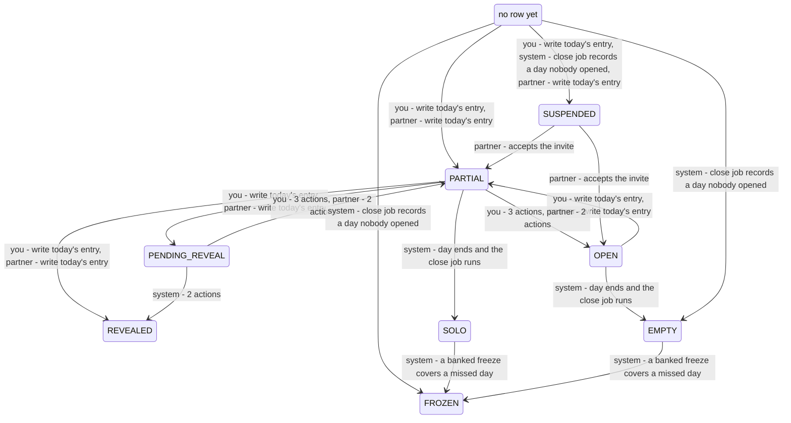
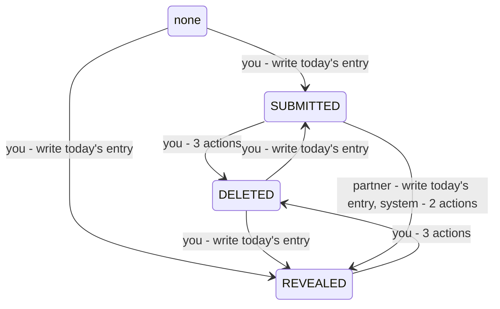
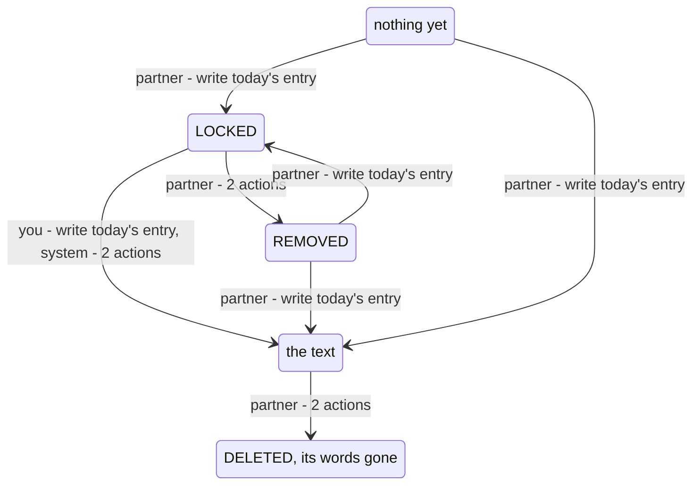

<!-- Generated by scripts/state-map-generate from docs/state-map/data. Do not edit. -->

# The day machine

Describes `main @ 174b474`. How to read this: [README](README.md).

Each region below has its own diagram. Each arrow says who acts: you, your partner or the system. Refusals are not drawn; they are in the tables. Grey means designed or only partly built, and no endpoint reaches it.

## The day

### Every action in every state

| Action | `NOT_OPENED` | `OPEN` | `PARTIAL` | `PENDING_REVEAL` | `REVEALED` | `SOLO` | `EMPTY` | `FROZEN` | `SUSPENDED` |
|---|---|---|---|---|---|---|---|---|---|
| write today's entry `POST /bonds/{bondId}/entries` | 201 → `PARTIAL` (the bond is two people, and the day did not end before the bond became two people) 201 → `SUSPENDED` (the bond is still waiting for its second member) 201 → `SUSPENDED` (an offline draft's intendedAt names a day that ended before the bond became two people) | 201 → `PARTIAL` | 409 `ENTRY_ALREADY_EXISTS` (a new request, and you have already written today) 201 → `REVEALED` (your partner has written, you have not, and the bond has no reveal time or it has passed) 201 → `PENDING_REVEAL` (your partner has written, you have not, and the bond's reveal time is still ahead) | 409 `ENTRY_ALREADY_EXISTS` (a new request) | 409 `DAY_CLOSED` (a new request, and the day is today) 201 stays (the day is an earlier one, named by an offline draft's intendedAt) | 201 stays (an offline draft's intendedAt names this day) | 201 stays (an offline draft's intendedAt names this day) | 201 stays (an offline draft's intendedAt names this day) | 201 stays (the bond is still waiting for its second member, and you have no live entry on the day) 409 `ENTRY_ALREADY_EXISTS` (a new request, the bond is still waiting for its second member, and you have a live entry on the day) 201 stays (your partner has since joined, the day ended before they did and is not yet stamped closed, and an offline draft's intendedAt names it) 201 stays (the close job has stamped the day closed, and an offline draft's intendedAt names it) |
| delete your entry `DELETE /entries/{entryId}` | not reachable | 204 stays | 204 → `OPEN` (the day's one live entry is yours) 204 stays (the live entry is your partner's, and you repeat the delete of one you already deleted) | 204 → `PARTIAL` (the entry is your live one) 204 stays (you repeat the delete of an entry you already deleted) | 204 stays | 204 stays | 204 stays | 204 stays | 204 stays (the day is still running, on a bond waiting for its second member) 204 stays (the close job has stamped the day closed) |
| read today `GET /bonds/{bondId}/today` | 200 stays (the bond is two people, or was) 200 stays (the bond is still waiting for its second member) 200 stays (the bond ended, or began counting down to deletion, while it still had one member) | 200 stays | 200 stays | 200 stays | 200 stays | not reachable | not reachable | not reachable | 200 stays (the bond is still waiting for its second member) 200 stays (the bond ended, or began counting down to deletion, while it still had one member) |
| read the streak `GET /bonds/{bondId}/streak` | 200 stays (the bond takes entries, and is two people) 200 stays (the bond has ended or is counting down to deletion) 200 stays (the bond is still waiting for its second member) | 200 stays (the bond takes entries) 200 stays (the bond has ended or is counting down to deletion) | 200 stays (the bond takes entries) 200 stays (the bond has ended or is counting down to deletion) | 200 stays (the bond takes entries) 200 stays (the bond has ended or is counting down to deletion) | 200 stays | 200 stays | 200 stays | 200 stays | 200 stays |
| leave the bond `POST /bonds/{bondId}/leave` | 204 stays | 204 stays | 204 → `OPEN` (the body says withdrawEntries: true, and the day's one live entry is yours) 204 stays (the body is absent, or does not say withdrawEntries: true; or the day's one live entry is your partner's) | 204 → `PARTIAL` (the body says withdrawEntries: true) 204 stays (the body is absent, or does not say withdrawEntries: true) | 204 stays | 204 stays | 204 stays | 204 stays | 204 stays |
| block your partner `POST /bonds/{bondId}/block` | 204 stays | 204 stays | 204 → `OPEN` (the body is absent, or does not say withdrawEntries: false, and the day's one live entry is yours) 204 stays (the body says withdrawEntries: false; or the day's one live entry is your partner's) | 204 → `PARTIAL` (the body is absent, or does not say withdrawEntries: false) 204 stays (the body says withdrawEntries: false) | 204 stays | 204 stays | 204 stays | 204 stays | 204 stays |

### You can

| In | Action | When | Leads to | Why | Evidence |
|---|---|---|---|---|---|
| `NOT_OPENED` | write today's entry | the bond is two people, and the day did not end before the bond became two people | `PARTIAL` | Yours is the first entry of the day, and this write is what opens the day's row. The row is inserted OPEN and counted to PARTIAL in the same transaction, so OPEN is never what this write commits. Your partner sees that you wrote, and nothing of what you wrote. | smoke |
| `NOT_OPENED` | write today's entry | the bond is still waiting for its second member | `SUSPENDED` | The creator may write before the invitee joins. This write opens the day's row, and opens it SUSPENDED: private, and never counted by the streak. | smoke |
| `NOT_OPENED` | write today's entry | an offline draft's intendedAt names a day that ended before the bond became two people | `SUSPENDED` | The draft is within the 36-hour offline window and the day has no row, so this write opens it, and opens it SUSPENDED. A day that ended before the bond became two people is suspended for good, so nothing on it is revealed, even with both entries in. | test |
| `OPEN` | write today's entry |  | `PARTIAL` | The day has a row and no live entry: an entry was deleted from it, or the joining day resumed empty. Yours is counted as its first. | test |
| `PARTIAL` | write today's entry | your partner has written, you have not, and the bond has no reveal time or it has passed | `REVEALED` | Yours is the second entry, so both are revealed in the same transaction and each of you can read the other. | smoke |
| `PARTIAL` | write today's entry | your partner has written, you have not, and the bond's reveal time is still ahead | `PENDING_REVEAL` | Yours is the second entry, but the bond has a reveal time that has not come, so both entries stay locked until it does. | smoke |
| `REVEALED` | write today's entry | the day is an earlier one, named by an offline draft's intendedAt | stays | A closed day takes no entry, and the only request that can name one is an offline draft's intendedAt. The claim is not used: the entry is filed on today instead, and this day does not change. If today cannot take it either, the answer is today's. | never-run |
| `SOLO` | write today's entry | an offline draft's intendedAt names this day | stays | A closed day takes no entry, and the only request that can name one is an offline draft's intendedAt. The claim is not used: the entry is filed on today instead, and this day does not change. If today cannot take it either, the answer is today's. | never-run |
| `EMPTY` | write today's entry | an offline draft's intendedAt names this day | stays | A closed day takes no entry, and the only request that can name one is an offline draft's intendedAt. The claim is not used: the entry is filed on today instead, and this day does not change. If today cannot take it either, the answer is today's. | test |
| `FROZEN` | write today's entry | an offline draft's intendedAt names this day | stays | A closed day takes no entry, and the only request that can name one is an offline draft's intendedAt. The claim is not used: the entry is filed on today instead, and this day does not change. If today cannot take it either, the answer is today's. | test |
| `SUSPENDED` | write today's entry | the bond is still waiting for its second member, and you have no live entry on the day | stays | A suspended day has a row because its creator wrote on it. With that entry deleted, a new one is accepted and counted, and the day stays suspended. | smoke |
| `SUSPENDED` | write today's entry | your partner has since joined, the day ended before they did and is not yet stamped closed, and an offline draft's intendedAt names it | stays | An offline draft may be filed on a day that ended before the bond became two people, while the close job has not yet stamped it. The entry is kept there and the day stays suspended, so nothing on it is ever revealed. | test |
| `SUSPENDED` | write today's entry | the close job has stamped the day closed, and an offline draft's intendedAt names it | stays | A closed day takes no entry, and the only request that can name one is an offline draft's intendedAt. The claim is not used: the entry is filed on today instead, and this day does not change. If today cannot take it either, the answer is today's. A suspended day is closed once the close job has stamped it: one that ended while the bond waited for its second member, or one that ended during a deletion countdown since called off. | test |
| `OPEN` | delete your entry |  | stays | An open day holds no live entry, so the only entry of yours on it is one you already deleted. Deleting it again is 204 and changes nothing. | test |
| `PARTIAL` | delete your entry | the day's one live entry is yours | `OPEN` | Deleting before the reveal steps the day back: it is counted again without your entry. | test |
| `PARTIAL` | delete your entry | the live entry is your partner's, and you repeat the delete of one you already deleted | stays | The entry was already erased, so the day is not stepped back a second time. | never-run |
| `PENDING_REVEAL` | delete your entry | the entry is your live one | `PARTIAL` | Nobody has read anything yet, so the day steps back to one entry. If you write again, the reveal rule is asked afresh. | test |
| `PENDING_REVEAL` | delete your entry | you repeat the delete of an entry you already deleted | stays | You deleted, wrote again, and still hold the first entry's id. That entry was already erased, so the day is not stepped back a second time. | never-run |
| `REVEALED` | delete your entry |  | stays | A revealed day is a record. Your words are erased; the day stays REVEALED and is not recounted. | smoke |
| `SOLO` | delete your entry |  | stays | A closed day is history. Your words are erased and the day stays SOLO. | test |
| `EMPTY` | delete your entry |  | stays | An empty day holds no live entry; at most one you deleted before it closed. Deleting that again is 204 and changes nothing. | never-run |
| `FROZEN` | delete your entry |  | stays | A day a freeze covered is closed. Your words are erased; the day stays FROZEN and the streak keeps the rest day. | never-run |
| `SUSPENDED` | delete your entry | the day is still running, on a bond waiting for its second member | stays | Your entry is erased and the day's count goes down by one. The day stays suspended, and you may write again. | smoke |
| `SUSPENDED` | delete your entry | the close job has stamped the day closed | stays | A suspended day the close job has stamped is settled. Your words are erased and the day is left as it is. | never-run |
| `NOT_OPENED` | read today | the bond is two people, or was | stays | The response says OPEN with both entries null: what the day would open as. Reading opens nothing; that no row is written is asserted by a separate test, not by the one cited. | test |
| `NOT_OPENED` | read today | the bond is still waiting for its second member | stays | The response says SUSPENDED, which is what the day would open as on a bond of one. No row is written. | test |
| `NOT_OPENED` | read today | the bond ended, or began counting down to deletion, while it still had one member | stays | The response says OPEN, not SUSPENDED, though nobody ever joined: the placeholder for a day with no row is SUSPENDED only while the bond's status is PENDING_MEMBER, and this bond's no longer is. Nothing can be written on it either way. | never-run |
| `OPEN` | read today |  | stays | The day has a row and no live entry, after a delete or an empty joining day. The response says OPEN, as it does for a day with no row; a member whose partner deleted is also shown that an entry was removed. | test |
| `PARTIAL` | read today |  | stays | One of you has written. The status is shared on purpose, so a member who has not written can tell that their partner has. | smoke |
| `PENDING_REVEAL` | read today |  | stays | Both of you have written and the bond's reveal time has not come. Each sees their own entry in full and the other's locked. | smoke |
| `REVEALED` | read today |  | stays | Both entries are readable by both of you, and today is counted in the streak the response carries. | smoke |
| `SUSPENDED` | read today | the bond is still waiting for its second member | stays | The day has a row because the creator wrote on it, and it stays suspended while the bond waits for its second member. The other kind of suspended day, one the close job stamped, is never today. | smoke |
| `SUSPENDED` | read today | the bond ended, or began counting down to deletion, while it still had one member | stays | The creator wrote today and then left the bond, or asked for its deletion, before anybody joined. The day has a row, and it reads SUSPENDED as it was stored. | never-run |
| `NOT_OPENED` | read the streak | the bond takes entries, and is two people | stays | Today has no row, and is on the calendar as an OPEN square all the same, so that the square's presence does not say somebody has written. The numbers are the run up to the last day the close job evaluated. | test |
| `NOT_OPENED` | read the streak | the bond has ended or is counting down to deletion | stays | Nobody can write in a bond that has stopped taking entries, so today is not drawn as open: the calendar ends at the last day that has a square. | test |
| `NOT_OPENED` | read the streak | the bond is still waiting for its second member | stays | A bond of one has no joining day, so its calendar is empty and every number is zero. | never-run |
| `OPEN` | read the streak | the bond takes entries | stays | A day with a row and no live entry is an OPEN square while it is today, exactly as a day with no row is. | never-run |
| `OPEN` | read the streak | the bond has ended or is counting down to deletion | stays | Nobody can write in a bond that has stopped taking entries, so today is not drawn as open: the calendar ends at the last day that has a square. | never-run |
| `PARTIAL` | read the streak | the bond takes entries | stays | Today's square still says OPEN: the calendar never says who has written so far. One entry adds nothing to the run. | test |
| `PARTIAL` | read the streak | the bond has ended or is counting down to deletion | stays | Nobody can write in a bond that has stopped taking entries, so today is not drawn as open: the calendar ends at the last day that has a square. The day's row stays unsettled until midnight all the same. | test |
| `PENDING_REVEAL` | read the streak | the bond takes entries | stays | A day waiting on its reveal time is not complete yet: its square says OPEN and it is not in the run. | smoke |
| `PENDING_REVEAL` | read the streak | the bond has ended or is counting down to deletion | stays | Nobody can write in a bond that has stopped taking entries, so today is not drawn as open: the calendar ends at the last day that has a square. | never-run |
| `REVEALED` | read the streak |  | stays | The day is a COMPLETE square. While it is today it is added to the run at read time, provided the day before has been evaluated; after midnight the close job evaluates it and stores the same number. | smoke |
| `SOLO` | read the streak |  | stays | Once the close job has evaluated it, a day one of you wrote on is a SOLO square and is not in the run. It has no square if it moved nothing: missed after the bond had ended, or during a deletion countdown since called off. | test |
| `EMPTY` | read the streak |  | stays | Once the close job has evaluated it, a day nobody wrote on is a MISSED square and is not in the run. It has no square if it moved nothing: missed after the bond had ended, or during a deletion countdown since called off. | test |
| `FROZEN` | read the streak |  | stays | A rest day: a freeze covered it, or a zone change stepped over the date. It is a FROZEN square and it keeps the run going. | test |
| `SUSPENDED` | read the streak |  | stays | A suspended day has no square and moves no number. A bond still waiting for its second member has no calendar at all, whatever its creator wrote. | test |
| `NOT_OPENED` | leave the bond |  | stays | The day has no row, and ending the bond writes none. Whether your entries are taken back makes no difference to it. A leave of a bond that has already ended is refused and takes nothing back: see the bond machine. | smoke |
| `OPEN` | leave the bond |  | stays | A day with a row and no live entry has nothing of yours on it to take back. It stays OPEN until the close job settles it. A leave of a bond that has already ended is refused and takes nothing back: see the bond machine. | never-run |
| `PARTIAL` | leave the bond | the body says withdrawEntries: true, and the day's one live entry is yours | `OPEN` | Right after the call the day still reads PARTIAL. Your entry is erased afterwards by the routine a delete uses (in seconds as a rule, and much later if the poller is stopped or a delivery is backing off), and a day still running then steps back exactly as it would for a delete. If the close job reaches the day first, it does the erasing itself before it decides anything (ADR-0035 §14). | never-run |
| `PARTIAL` | leave the bond | the body is absent, or does not say withdrawEntries: true; or the day's one live entry is your partner's | stays | Nothing of yours is erased on this day, so it is counted as before. It closes SOLO when it ends, and the lone entry is not unlocked, because the bond stopped taking writes first. | never-run |
| `PENDING_REVEAL` | leave the bond | the body says withdrawEntries: true | `PARTIAL` | After the call your entry is erased (in seconds as a rule, and much later if the poller is stopped or a delivery is backing off), so the day steps back to your partner's entry alone. If the reveal time or the close job reaches the day first, it erases your entry itself before deciding, so the reveal does not happen either way (ADR-0035 §14). | never-run |
| `PENDING_REVEAL` | leave the bond | the body is absent, or does not say withdrawEntries: true | stays | Both entries stay, and the day goes on waiting. Ending the bond does not stop the reveal: at the reveal time, or at the day's end, the close job reveals both entries all the same. ADR-0035 records this as an open question for the owner, and no test pins it. | never-run |
| `REVEALED` | leave the bond |  | stays | A settled day is never recounted. If your entries are taken back, yours on this day becomes a tombstone and the day keeps its status. A leave of a bond that has already ended is refused and takes nothing back: see the bond machine. | test |
| `SOLO` | leave the bond |  | stays | A settled day is never recounted. If your entries are taken back, yours on this day becomes a tombstone and the day keeps its status. A leave of a bond that has already ended is refused and takes nothing back: see the bond machine. | never-run |
| `EMPTY` | leave the bond |  | stays | A settled day is never recounted. If your entries are taken back, yours on this day becomes a tombstone and the day keeps its status. A leave of a bond that has already ended is refused and takes nothing back: see the bond machine. | never-run |
| `FROZEN` | leave the bond |  | stays | A settled day is never recounted. If your entries are taken back, yours on this day becomes a tombstone and the day keeps its status. A leave of a bond that has already ended is refused and takes nothing back: see the bond machine. | never-run |
| `SUSPENDED` | leave the bond |  | stays | A suspended day stays suspended, with your entry or without it. A leave of a bond that has already ended is refused and takes nothing back: see the bond machine. | never-run |
| `NOT_OPENED` | block your partner |  | stays | The day has no row, and ending the bond writes none. Whether your entries are taken back makes no difference to it. | smoke |
| `OPEN` | block your partner |  | stays | A day with a row and no live entry has nothing of yours on it to take back. It stays OPEN until the close job settles it. | never-run |
| `PARTIAL` | block your partner | the body is absent, or does not say withdrawEntries: false, and the day's one live entry is yours | `OPEN` | Right after the call the day still reads PARTIAL. Your entry is erased afterwards by the routine a delete uses (in seconds as a rule, and much later if the poller is stopped or a delivery is backing off), and a day still running then steps back exactly as it would for a delete. If the close job reaches the day first, it does the erasing itself before it decides anything (ADR-0035 §14). | test |
| `PARTIAL` | block your partner | the body says withdrawEntries: false; or the day's one live entry is your partner's | stays | Nothing of yours is erased on this day, so it is counted as before. It closes SOLO when it ends, and the lone entry is not unlocked, because the bond stopped taking writes first. | never-run |
| `PENDING_REVEAL` | block your partner | the body is absent, or does not say withdrawEntries: false | `PARTIAL` | After the call your entry is erased (in seconds as a rule, and much later if the poller is stopped or a delivery is backing off), so the day steps back to your partner's entry alone. If the reveal time or the close job reaches the day first, it erases your entry itself before deciding, so the reveal does not happen either way (ADR-0035 §14). | never-run |
| `PENDING_REVEAL` | block your partner | the body says withdrawEntries: false | stays | Both entries stay, and the day goes on waiting. Ending the bond does not stop the reveal: at the reveal time, or at the day's end, the close job reveals both entries all the same. ADR-0035 records this as an open question for the owner, and no test pins it. | never-run |
| `REVEALED` | block your partner |  | stays | A settled day is never recounted. If your entries are taken back, yours on this day becomes a tombstone and the day keeps its status. | test |
| `SOLO` | block your partner |  | stays | A settled day is never recounted. If your entries are taken back, yours on this day becomes a tombstone and the day keeps its status. | never-run |
| `EMPTY` | block your partner |  | stays | A settled day is never recounted. If your entries are taken back, yours on this day becomes a tombstone and the day keeps its status. | never-run |
| `FROZEN` | block your partner |  | stays | A settled day is never recounted. If your entries are taken back, yours on this day becomes a tombstone and the day keeps its status. | never-run |
| `SUSPENDED` | block your partner |  | stays | A suspended day stays suspended, with your entry or without it. | never-run |

### Refused here

| In | Action | When | Answer | Why | Rule | Evidence |
|---|---|---|---|---|---|---|
| `PARTIAL` | write today's entry | a new request, and you have already written today | 409 `ENTRY_ALREADY_EXISTS` | One entry per member per day. The database's unique index refuses the second; the first is untouched. | BR-2 | smoke |
| `PENDING_REVEAL` | write today's entry | a new request | 409 `ENTRY_ALREADY_EXISTS` | Both of you have written and the day is only waiting for its time, so any write here is a second entry from its author. | BR-2 | never-run |
| `REVEALED` | write today's entry | a new request, and the day is today | 409 `DAY_CLOSED` | A revealed day is settled: its words have been read. The day is checked before the entry is inserted, so this is the answer whether you still have an entry on it or deleted yours, which is what stops delete-then-rewrite replacing words already read. | BR-10, ADR-0032 §8 | test |
| `SUSPENDED` | write today's entry | a new request, the bond is still waiting for its second member, and you have a live entry on the day | 409 `ENTRY_ALREADY_EXISTS` | One entry per member per day holds on a suspended day as on any other. | BR-2 | never-run |

### Happens without you

| In | What happens | Who | When | Leads to | Why | Evidence |
|---|---|---|---|---|---|---|
| `OPEN` | the day ends and the close job runs | system |  | `EMPTY` | The day ended with no live entry. The close job, which runs a minute past every quarter-hour, closes it as EMPTY. | test |
| `PARTIAL` | the day ends and the close job runs | system |  | `SOLO` | The day ended with one entry, so it closes as a solo day. | test |
| `PENDING_REVEAL` | the reveal time arrives | system |  | `REVEALED` | Nothing watches the clock for one day. The close job looks at every day waiting on a reveal time on each run and reveals those whose time has come, so the reveal lands up to a quarter of an hour after the time set. No request does this, not even GET /today. | test |
| `PENDING_REVEAL` | the day ends and the close job runs | system |  | `REVEALED` | A reveal time later than the day's own end cannot hold the entries back past it: the day is revealed and closed in one step. | test |
| `REVEALED` | the day ends and the close job runs | system |  | `REVEALED` | A day revealed while it was running is stamped closed and nothing else about it changes. | test |
| `SUSPENDED` | the day ends and the close job runs | system | the day ended before your partner joined, or nobody has joined yet | `SUSPENDED` | A day that ended before the bond became two people is stamped closed as it stands. Nothing on it is revealed and it stays private for good. | test |
| `NOT_OPENED` | your partner accepts the invite | partner |  | `NOT_OPENED` | Nothing is stored for a day nobody has written on, so the pairing changes no row. What changes is the answer: GET /today reported SUSPENDED and now reports OPEN, and the first write opens the row OPEN instead of SUSPENDED. | never-run |
| `SUSPENDED` | your partner accepts the invite | partner | the joining day has a row and no live entry: the creator wrote on it and deleted | `OPEN` | The day the bond becomes two people is an ordinary day from then on. The stored row is resumed by the first request either of you makes, before anything is read, or by the close job; no response after the pairing shows that day as SUSPENDED. | test |
| `SUSPENDED` | your partner accepts the invite | partner | one of you wrote on the joining day while waiting | `PARTIAL` | What the creator wrote while waiting counts from the pairing on: the joining day resumes with one entry, locked to the member who has just joined. A joining day left with both entries on it by the first build of this slice resumes straight to REVEALED or PENDING_REVEAL; nothing the current code writes can be in that state. | test |
| `NOT_OPENED` | the close job records a day nobody opened | system | the day ran from the day the bond became two people until it ended, and did not end inside a deletion countdown that was later called off | `EMPTY` | Nobody wrote, so the day never had a row. Once it has ended the close job writes one, already closed as EMPTY. That includes a day on which the bond ended or began a countdown: it began while the bond took entries. A day from before the pairing, or one that began after the bond ended, is never written and stays without a row. | test |
| `NOT_OPENED` | the close job records a day nobody opened | system | the day ended while a deletion was counting down, and the deletion was later called off | `SUSPENDED` | The bond took no entries when this day ended, so nobody missed it: it is written SUSPENDED and closed, and the streak passes over it. | test |
| `NOT_OPENED` | the close job records a day nobody opened | system | the date is one a zone change stepped over | `FROZEN` | An agreed zone change that moves the calendar east steps over a date. That date has no hours and was never anybody's today; the close job writes it FROZEN, closed, without spending a freeze, and it keeps the run going. | test |
| `SOLO` | a banked freeze covers a missed day | system |  | `FROZEN` | A missed day spends a banked freeze when Strict mode is off and there is a run to save. This is the one change evaluation makes to a closed day's status. The lone entry stays revealed. | test |
| `EMPTY` | a banked freeze covers a missed day | system |  | `FROZEN` | A day nobody wrote on is covered the same way: a banked freeze, Strict mode off, and a run to save. | test |
| `PARTIAL` | your partner takes their entries back | partner | the day's one live entry is your partner's | `OPEN` | A withdrawal erases each of its author's entries by the routine a delete uses, some seconds after the bond ends, so a day still running steps back exactly as it would for a delete. | test |
| `PARTIAL` | your partner takes their entries back | partner | the day's one live entry is yours | `PARTIAL` | A withdrawal erases its author's live entries and no one else's. Your partner has none on this day, so the day and your entry stay as they are. | never-run |
| `PENDING_REVEAL` | your partner takes their entries back | partner |  | `PARTIAL` | Your partner's entry is erased before anything was revealed, so the day steps back to yours alone and the reveal never happens. | never-run |
| `NOT_OPENED` | write today's entry | partner | the bond is two people, and the day did not end before the bond became two people | `PARTIAL` | Your partner wrote first, and their write opened the day's row. You can see that they have, because the day's status is shared, and nothing of what they wrote. | test |
| `NOT_OPENED` | write today's entry | partner | your partner's offline draft names a day that ended before the bond became two people | `SUSPENDED` | Your partner's offline draft opens the day's row, SUSPENDED. A day that ended before the bond became two people is suspended for good, so nothing on it is revealed, even with both entries in. | test |
| `OPEN` | write today's entry | partner |  | `PARTIAL` | The day had a row and no live entry, and your partner's entry is counted as its first. | never-run |
| `PARTIAL` | write today's entry | partner | you have written, and the bond has no reveal time or it has passed | `REVEALED` | You had written, so your partner's entry is the second and the day is revealed in their transaction. | test |
| `PARTIAL` | write today's entry | partner | you have written, and the bond's reveal time is still ahead | `PENDING_REVEAL` | You had written and your partner's entry is the second, but the bond's reveal time has not come. | test |
| `PARTIAL` | delete their entry | partner | the day's one live entry is your partner's | `OPEN` | Your partner deleted before the reveal, so the day steps back. You are shown that an entry of theirs was removed. | test |
| `PENDING_REVEAL` | delete their entry | partner |  | `PARTIAL` | Your partner deleted while both entries were waiting, so the day steps back to yours alone. | test |

## Your entry

### Every action in every state

| Action | `NONE` | `SUBMITTED` | `REVEALED` | `DELETED` |
|---|---|---|---|---|
| write today's entry `POST /bonds/{bondId}/entries` | 201 → `SUBMITTED` (your partner has not written, or the bond's reveal time is still ahead) 201 → `REVEALED` (your partner has already written, and the bond has no reveal time or it has passed, and the day did not end before the bond became two people) 201 → `SUBMITTED` (an offline draft's intendedAt names a day that ended before the bond became two people) | 409 `ENTRY_ALREADY_EXISTS` (a new request) 201 stays (the request repeats an Idempotency-Key and body you already sent) | 409 `DAY_CLOSED` (a new request, and the entry's day is today) 201 stays (the request repeats an Idempotency-Key and body you already sent) 201 stays (a new request whose intendedAt names the entry's day, and that day is an earlier one) | 201 → `SUBMITTED` (you deleted it before the reveal, and your partner has not written or the reveal time is still ahead) 201 → `REVEALED` (you deleted it before the reveal, your partner has written, and the bond has no reveal time or it has passed, and the day did not end before the bond became two people) 409 `DAY_CLOSED` (a new request, and you deleted it after the reveal) 201 stays (the request repeats an Idempotency-Key and body you already sent) |
| edit your entry `PATCH /entries/{entryId}` | 404 `NOT_FOUND` | 200 stays (a new request) 200 stays (the request repeats an Idempotency-Key and body you already sent) | 409 `ENTRY_IMMUTABLE` (a new request) 200 stays (the request repeats an Idempotency-Key and body you already sent) | 409 `ENTRY_IMMUTABLE` (a new request) 200 stays (the request repeats an Idempotency-Key and body you already sent) |
| delete your entry `DELETE /entries/{entryId}` | 404 `NOT_FOUND` | 204 → `DELETED` (the bond takes entries) 204 → `DELETED` (the bond has ended or is counting down to deletion, or you have left it) | 204 → `DELETED` (the bond takes entries) 204 → `DELETED` (the bond has ended or is counting down to deletion, or you have left it) | 204 stays |
| leave the bond `POST /bonds/{bondId}/leave` | 204 stays | 204 → `DELETED` (the body says withdrawEntries: true) 204 stays (the body is absent, or does not say withdrawEntries: true) | 204 → `DELETED` (the body says withdrawEntries: true) 204 stays (the body is absent, or does not say withdrawEntries: true) | 204 stays |
| block your partner `POST /bonds/{bondId}/block` | 204 stays | 204 → `DELETED` (the body is absent, or does not say withdrawEntries: false) 204 stays (the body says withdrawEntries: false) | 204 → `DELETED` (the body is absent, or does not say withdrawEntries: false) 204 stays (the body says withdrawEntries: false) | 204 stays |

### You can

| In | Action | When | Leads to | Why | Evidence |
|---|---|---|---|---|---|
| `NONE` | write today's entry | your partner has not written, or the bond's reveal time is still ahead | `SUBMITTED` | Your entry is stored and is yours alone to read until the day is revealed. | smoke |
| `NONE` | write today's entry | your partner has already written, and the bond has no reveal time or it has passed, and the day did not end before the bond became two people | `REVEALED` | Yours is the second entry and nothing holds the reveal back, so it is revealed in the transaction that stores it. | test |
| `NONE` | write today's entry | an offline draft's intendedAt names a day that ended before the bond became two people | `SUBMITTED` | Your entry is stored on the suspended day and stays SUBMITTED, yours alone, whether or not your partner wrote on that day too. | test |
| `SUBMITTED` | write today's entry | the request repeats an Idempotency-Key and body you already sent | stays | A replay writes no entry. It answers the first request's 201 with Idempotency-Replayed: true and the entry read as it stands now, so none of a new write's refusals apply, on a revealed day or an ended bond alike. | smoke |
| `REVEALED` | write today's entry | the request repeats an Idempotency-Key and body you already sent | stays | A replay writes no entry. It answers the first request's 201 with Idempotency-Replayed: true and the entry read as it stands now, so none of a new write's refusals apply, on a revealed day or an ended bond alike. | test |
| `REVEALED` | write today's entry | a new request whose intendedAt names the entry's day, and that day is an earlier one | stays | The entry's day is settled, so the claim is not used: the new entry is filed on today, and this one is untouched. If today cannot take it, the answer is today's. | never-run |
| `DELETED` | write today's entry | you deleted it before the reveal, and your partner has not written or the reveal time is still ahead | `SUBMITTED` | Deleting before the reveal freed your place for the day. The replacement is a new entry with a new id; the deleted one stays as its tombstone, and today shows the live one. | smoke |
| `DELETED` | write today's entry | you deleted it before the reveal, your partner has written, and the bond has no reveal time or it has passed, and the day did not end before the bond became two people | `REVEALED` | The replacement is the day's second live entry, so it meets the reveal rule afresh and both are revealed. | never-run |
| `DELETED` | write today's entry | the request repeats an Idempotency-Key and body you already sent | stays | A replay writes no entry. It answers the first request's 201 with Idempotency-Replayed: true and the entry read as it stands now, so none of a new write's refusals apply, on a revealed day or an ended bond alike. The body is the tombstone: there is no second copy of the words to answer from. | smoke |
| `SUBMITTED` | edit your entry | a new request | stays | Nobody else has been entitled to read it yet, so the text is replaced. Only the text can change. | smoke |
| `SUBMITTED` | edit your entry | the request repeats an Idempotency-Key and body you already sent | stays | A replay of a keyed edit writes no entry and does not apply the edit again. It answers 200 with Idempotency-Replayed: true and the entry read as it stands now. | never-run |
| `REVEALED` | edit your entry | the request repeats an Idempotency-Key and body you already sent | stays | A replay of a keyed edit writes no entry and does not apply the edit again. It answers 200 with Idempotency-Replayed: true and the entry read as it stands now. An edit made before the reveal and repeated after it is not refused. | never-run |
| `DELETED` | edit your entry | the request repeats an Idempotency-Key and body you already sent | stays | A replay of a keyed edit writes no entry and does not apply the edit again. It answers 200 with Idempotency-Replayed: true and the entry read as it stands now. The body is the tombstone, without the words the edit wrote. | test |
| `SUBMITTED` | delete your entry | the bond takes entries | `DELETED` | The words are erased and the row is kept as a tombstone. Before the reveal this also frees your place, so you may write the day again. | smoke |
| `SUBMITTED` | delete your entry | the bond has ended or is counting down to deletion, or you have left it | `DELETED` | An author may always take their own words back, also after the bond has ended and after leaving it. Only an edit is refused there. | test |
| `REVEALED` | delete your entry | the bond takes entries | `DELETED` | The words are erased for both of you; your partner is left a tombstone. The reveal stamp is kept and the day stays as it was. | smoke |
| `REVEALED` | delete your entry | the bond has ended or is counting down to deletion, or you have left it | `DELETED` | An author may always take their own words back, also after the bond has ended and after leaving it. Only an edit is refused there. | smoke |
| `DELETED` | delete your entry |  | stays | Deleting is repeatable: an entry already erased is returned as it is and nothing is written. | smoke |
| `NONE` | leave the bond |  | stays | You have no entry on this day, so there is nothing to keep and nothing to take back. A leave of a bond that has already ended is refused and takes nothing back: see the bond machine. | smoke |
| `SUBMITTED` | leave the bond | the body says withdrawEntries: true | `DELETED` | Your entries are taken back in the same transaction. From that commit yours reads as DELETED with no text, to you as well; your partner, who never could read it, sees only that it is gone. The rows themselves are erased afterwards: in seconds as a rule, and much later if the poller is stopped or a delivery is backing off. | never-run |
| `SUBMITTED` | leave the bond | the body is absent, or does not say withdrawEntries: true | stays | Your entry is left as it is. If you alone wrote on its day, it stays yours alone: the day closes SOLO and a lone entry is not unlocked once the bond has ended. If both of you wrote and the day is waiting for its reveal time, it is still revealed at that time or at the day's end, ended bond or not (ADR-0035, owner question 9; no test pins it). You may still delete it yourself. | never-run |
| `REVEALED` | leave the bond | the body says withdrawEntries: true | `DELETED` | Your entries are taken back in the same transaction. From that commit yours reads as DELETED with no text, to both of you, though your partner had read it; the rows are erased afterwards, in seconds as a rule, and much later if the poller is stopped or a delivery is backing off. Your partner's own entries are untouched. | test |
| `REVEALED` | leave the bond | the body is absent, or does not say withdrawEntries: true | stays | Your revealed entry stays readable to both of you, in a record neither can add to. You may still delete it yourself. | test |
| `DELETED` | leave the bond |  | stays | An entry you already deleted has no words left to take back; it stays the tombstone it was. A leave of a bond that has already ended is refused and takes nothing back: see the bond machine. | never-run |
| `NONE` | block your partner |  | stays | You have no entry on this day, so there is nothing to keep and nothing to take back. | smoke |
| `SUBMITTED` | block your partner | the body is absent, or does not say withdrawEntries: false | `DELETED` | Your entries are taken back in the same transaction. From that commit yours reads as DELETED with no text, to you as well; your partner, who never could read it, sees only that it is gone. The rows themselves are erased afterwards: in seconds as a rule, and much later if the poller is stopped or a delivery is backing off. | test |
| `SUBMITTED` | block your partner | the body says withdrawEntries: false | stays | Your entry is left as it is. If you alone wrote on its day, it stays yours alone: the day closes SOLO and a lone entry is not unlocked once the bond has ended. If both of you wrote and the day is waiting for its reveal time, it is still revealed at that time or at the day's end, ended bond or not (ADR-0035, owner question 9; no test pins it). You may still delete it yourself. | never-run |
| `REVEALED` | block your partner | the body is absent, or does not say withdrawEntries: false | `DELETED` | Your entries are taken back in the same transaction. From that commit yours reads as DELETED with no text, to both of you, though your partner had read it; the rows are erased afterwards, in seconds as a rule, and much later if the poller is stopped or a delivery is backing off. Your partner's own entries are untouched. | test |
| `REVEALED` | block your partner | the body says withdrawEntries: false | stays | Your revealed entry stays readable to both of you, in a record neither can add to. You may still delete it yourself. Repeating the block without the flag takes it back after all. | smoke |
| `DELETED` | block your partner |  | stays | An entry you already deleted has no words left to take back; it stays the tombstone it was. | never-run |

### Refused here

| In | Action | When | Answer | Why | Rule | Evidence |
|---|---|---|---|---|---|---|
| `SUBMITTED` | write today's entry | a new request | 409 `ENTRY_ALREADY_EXISTS` | You have a live entry for today. Edit it, or delete it and write again; a second one is refused. | BR-2 | smoke |
| `REVEALED` | write today's entry | a new request, and the entry's day is today | 409 `DAY_CLOSED` | Your entry has been revealed, so its day is settled. The day is checked before the insert, so the answer is DAY_CLOSED and not ENTRY_ALREADY_EXISTS. | BR-10 | never-run |
| `DELETED` | write today's entry | a new request, and you deleted it after the reveal | 409 `DAY_CLOSED` | The day was revealed before you deleted, and a revealed day is a record: your place is free but the day takes no new entry. | BR-10, ADR-0032 §8 | test |
| `NONE` | edit your entry |  | 404 `NOT_FOUND` | You have no entry behind the id you sent. Your partner's entry, a stranger's and an id nobody has all get this one answer. | ADR-0032 §9 | smoke |
| `REVEALED` | edit your entry | a new request | 409 `ENTRY_IMMUTABLE` | Your partner may already have read these words, so they can no longer be changed. You can still delete the entry. | BR-7 | smoke |
| `DELETED` | edit your entry | a new request | 409 `ENTRY_IMMUTABLE` | An erased entry has no words to edit, and the answer does not say whether it was ever revealed. | BR-7 | test |
| `NONE` | delete your entry |  | 404 `NOT_FOUND` | You have no entry behind the id you sent. Your partner's entry, a stranger's and an id nobody has all get this one answer. | ADR-0032 §9 | smoke |

### Happens without you

| In | What happens | Who | When | Leads to | Why | Evidence |
|---|---|---|---|---|---|---|
| `SUBMITTED` | write today's entry | partner | the bond has no reveal time, or it has passed, and the day did not end before the bond became two people | `REVEALED` | Your partner's entry is the day's second, so yours is revealed in their transaction and can no longer be edited. | test |
| `SUBMITTED` | write today's entry | partner | the bond's reveal time is still ahead | `SUBMITTED` | Both of you have written, but the reveal time has not come. Your entry stays SUBMITTED, and so stays editable. | test |
| `SUBMITTED` | write today's entry | partner | the day is one that ended before the bond became two people | `SUBMITTED` | Your partner's entry is the second on a suspended day, and a suspended day never reveals. Yours stays SUBMITTED. | test |
| `SUBMITTED` | the reveal time arrives | system |  | `REVEALED` | Both entries of a day that was waiting are stamped revealed together, by the close job's first run after the time. | test |
| `SUBMITTED` | the day ends and the close job runs | system | you were the only one to write, and the bond had not ended before the day did | `REVEALED` | A lone entry is unlocked to the partner who did not write when the day closes SOLO. | test |
| `SUBMITTED` | the day ends and the close job runs | system | you were the only one to write, and the bond ended, or began counting down to deletion, before the day did | `SUBMITTED` | The day still closes SOLO, but the entry is not revealed: it was written for a bond that was still yours, and only you ever read it. | test |
| `SUBMITTED` | the day ends and the close job runs | system | both of you wrote, and the reveal time had not come when the day ended | `REVEALED` | The day's own end outranks a reveal time later than it, so both entries are revealed as the day closes. | test |
| `SUBMITTED` | the day ends and the close job runs | system | the day is suspended | `SUBMITTED` | An entry written before the bond became two people is never revealed. It stays SUBMITTED, and only its author reads it. | test |

## What you see of your partner's entry

### Every action in every state

| Action | `NONE` | `LOCKED` | `VISIBLE` | `REMOVED` | `DELETED` |
|---|---|---|---|---|---|
| write today's entry `POST /bonds/{bondId}/entries` | 201 stays (you have not yet written today) | 201 → `VISIBLE` (you have not yet written today, and the bond has no reveal time or it has passed, and the day did not end before the bond became two people) 201 stays (you have not yet written today, and the bond's reveal time is still ahead) 201 stays (an offline draft's intendedAt names a day that ended before the bond became two people, and your partner has written on it) | 409 `DAY_CLOSED` (a new request) | 201 stays (you have not yet written today) | 409 `DAY_CLOSED` (a new request) |
| read today `GET /bonds/{bondId}/today` | 200 stays | 200 stays | 200 stays | 200 stays | 200 stays |

### You can

| In | Action | When | Leads to | Why | Evidence |
|---|---|---|---|---|---|
| `NONE` | write today's entry | you have not yet written today | stays | Your partner has written nothing, so your write changes nothing you see of theirs. | smoke |
| `LOCKED` | write today's entry | you have not yet written today, and the bond has no reveal time or it has passed, and the day did not end before the bond became two people | `VISIBLE` | Writing your own entry is what unlocks your partner's: both are revealed together. | smoke |
| `LOCKED` | write today's entry | you have not yet written today, and the bond's reveal time is still ahead | stays | Both of you have now written, but the bond's reveal time has not come, so your partner's entry stays locked. | smoke |
| `LOCKED` | write today's entry | an offline draft's intendedAt names a day that ended before the bond became two people, and your partner has written on it | stays | Both of you have now written on the suspended day, and nothing is revealed: your partner's entry stays locked to you for good. No built endpoint shows a past day yet, so this is what the entry is, not something a response shows. | test |
| `REMOVED` | write today's entry | you have not yet written today | stays | Your partner deleted their entry before the reveal. Your write is accepted and their removed entry stays as it is; nothing is revealed until they write again. | never-run |
| `NONE` | read today |  | stays | partnerEntry is null: your partner has no entry on today. | test |
| `LOCKED` | read today |  | stays | You are shown who wrote it and the word LOCKED, and nothing else: no text, no id, no time, no length. | test |
| `VISIBLE` | read today |  | stays | The entry has been revealed, so you read it in full. What decides this is the entry's own reveal stamp, never the day's status. | smoke |
| `REMOVED` | read today |  | stays | Your partner deleted or withdrew it before you could ever read it. You are shown who wrote it and the word REMOVED: no id and no times, which were never yours to see. | test |
| `DELETED` | read today |  | stays | Your partner deleted or withdrew an entry you had already been able to read. You are shown the same entry without its words: its id and times, text null, status DELETED. | smoke |

### Refused here

| In | Action | When | Answer | Why | Rule | Evidence |
|---|---|---|---|---|---|---|
| `VISIBLE` | write today's entry | a new request | 409 `DAY_CLOSED` | You can read your partner's words only on a revealed day, and a revealed day takes no new entry. | BR-10 | test |
| `DELETED` | write today's entry | a new request | 409 `DAY_CLOSED` | A tombstone with its id and dates is shown only for an entry you could once read, so the day was revealed, and a revealed day takes no new entry. | BR-10 | never-run |

### Happens without you

| In | What happens | Who | When | Leads to | Why | Evidence |
|---|---|---|---|---|---|---|
| `NONE` | write today's entry | partner | you have not written, or the bond's reveal time is still ahead | `LOCKED` | Your partner has written. Until the reveal you are shown who wrote and nothing else. | test |
| `NONE` | write today's entry | partner | you have already written, and the bond has no reveal time or it has passed, and the day did not end before the bond became two people | `VISIBLE` | You had already written, so your partner's entry is the second and both are revealed at once. | test |
| `NONE` | write today's entry | partner | the day is one that ended before the bond became two people | `LOCKED` | Your partner filed an offline draft on a suspended day. It is locked to you and stays so, even if you wrote on that day as well. | test |
| `LOCKED` | delete their entry | partner |  | `REMOVED` | A delete before the reveal is visible to you as a removal: who wrote, and that it is gone. | test |
| `VISIBLE` | delete their entry | partner |  | `DELETED` | The words you could read are erased. You keep the entry's id and times, because you already knew them. | test |
| `REMOVED` | write today's entry | partner | you have not written, or the bond's reveal time is still ahead | `LOCKED` | Your partner wrote again after deleting. Today shows a live entry in preference to an erased one, so you see the new one, locked. | never-run |
| `REMOVED` | write today's entry | partner | you have written, and the bond has no reveal time or it has passed, and the day did not end before the bond became two people | `VISIBLE` | Your partner wrote again after deleting, and you had written meanwhile. Theirs is the day's second live entry, so both are revealed and you read it. | never-run |
| `LOCKED` | the reveal time arrives | system |  | `VISIBLE` | Both of you had written and were waiting. The close job's first run after the reveal time unlocks both entries. | test |
| `LOCKED` | the day ends and the close job runs | system | your partner alone wrote, the day is not suspended, and the bond had not ended before the day did | `VISIBLE` | Your partner wrote and you did not. When the day closes SOLO their entry is unlocked to you all the same. By then the day is no longer today, and no built endpoint shows a past day yet (the archive is slice C5b). | test |
| `LOCKED` | the day ends and the close job runs | system | both of you wrote, the day is not suspended, and the reveal time had not come when the day ended | `VISIBLE` | The day's own end outranks a reveal time later than it, so both entries are revealed as the day closes. | test |
| `LOCKED` | the day ends and the close job runs | system | your partner alone wrote, the day is not suspended, and the bond ended, or began counting down to deletion, before the day did | `LOCKED` | The day closes SOLO, but the lone entry is not unlocked: it was written for a bond that was still its author's, and stays theirs alone. | test |
| `LOCKED` | the day ends and the close job runs | system | the day is suspended | `LOCKED` | The close job stamps a suspended day closed and reveals nothing on it: it unlocks a lone entry only on a day that closes SOLO. Your partner's entry stays locked to you. The test cited asserts that nothing is revealed on a bond of one, where the entry is the author's own. | test |
| `LOCKED` | your partner takes their entries back | partner |  | `REMOVED` | A withdrawal hides the entry from the moment the bond ends, before anything is erased. You never could read it, so you see only that it is gone. | test |
| `VISIBLE` | your partner takes their entries back | partner |  | `DELETED` | Your very next read no longer carries the words, though the rows are erased only seconds later. Your own entry is untouched. | smoke |

## Where the contract is silent

The code answers these and `contracts/openapi.json` does not document them.

| Endpoint | Status | What the code does |
|---|---|---|
| `POST /bonds/{bondId}/leave` | 415 | A Content-Type other than application/json is 415 UNSUPPORTED_MEDIA_TYPE even with no body, for a member and a stranger alike; it is what curl -X POST -d '' sends. Any route that reads a JSON body answers 415 UNSUPPORTED_MEDIA_TYPE to another Content-Type; the contract's generator (OpenApiConfiguration.statusesFor) adds 415 only to the two Idempotency-Key routes. |
| `POST /bonds/{bondId}/block` | 415 | A Content-Type other than application/json is 415 UNSUPPORTED_MEDIA_TYPE even with no body, for a member and a stranger alike; it is what curl -X POST -d '' sends. Any route that reads a JSON body answers 415 UNSUPPORTED_MEDIA_TYPE to another Content-Type; the contract's generator (OpenApiConfiguration.statusesFor) adds 415 only to the two Idempotency-Key routes. |
