<!-- Generated by scripts/state-map-generate from docs/state-map/data. Do not edit. -->

# The day machine

Describes `main @ 174b474`. How to read this: [README](README.md).

```mermaid
stateDiagram-v2
    state "The day" as day {
        state "OPEN" as day__OPEN
        state "PARTIAL" as day__PARTIAL
        state "PENDING_REVEAL" as day__PENDING_REVEAL
        state "REVEALED" as day__REVEALED
        state "SOLO" as day__SOLO
        state "EMPTY" as day__EMPTY
        state "FROZEN" as day__FROZEN
        state "SUSPENDED" as day__SUSPENDED
        day__OPEN --> day__PARTIAL: you - write today's entry
        day__PARTIAL --> day__REVEALED: you - write today's entry
        day__PARTIAL --> day__PENDING_REVEAL: you - write today's entry
        day__PARTIAL --> day__OPEN: you - delete your entry
        day__PENDING_REVEAL --> day__PARTIAL: you - delete your entry
    }
    state "Your entry" as day_entry {
        state "none" as day_entry__NONE
        state "SUBMITTED" as day_entry__SUBMITTED
        state "REVEALED" as day_entry__REVEALED
        state "DELETED" as day_entry__DELETED
        day_entry__NONE --> day_entry__SUBMITTED: you - write today's entry
        day_entry__NONE --> day_entry__REVEALED: you - write today's entry
        day_entry__DELETED --> day_entry__SUBMITTED: you - write today's entry
        day_entry__DELETED --> day_entry__REVEALED: you - write today's entry
    }
    state "What you see of your partner's entry" as day_partnerEntry {
        state "nothing yet" as day_partnerEntry__NONE
        state "LOCKED" as day_partnerEntry__LOCKED
        state "the text" as day_partnerEntry__VISIBLE
        state "REMOVED" as day_partnerEntry__REMOVED
        state "DELETED, its words gone" as day_partnerEntry__DELETED
        day_partnerEntry__LOCKED --> day_partnerEntry__VISIBLE: you - write today's entry
    }
```

Each arrow says who acts: you, your partner or the system. Refusals are not drawn; they are in the tables below.

## The day

### Every action in every state

| Action | `OPEN` | `PARTIAL` | `PENDING_REVEAL` | `REVEALED` | `SOLO` | `EMPTY` | `FROZEN` | `SUSPENDED` |
|---|---|---|---|---|---|---|---|---|
| write today's entry `POST /bonds/{bondId}/entries` | 201 → `PARTIAL` | 409 `ENTRY_ALREADY_EXISTS` (you have already written today) 201 → `REVEALED` (your partner has written, you have not, and the bond has no reveal time or it has passed) 201 → `PENDING_REVEAL` (your partner has written, you have not, and the bond's reveal time is still ahead) | 409 `ENTRY_ALREADY_EXISTS` | 409 `DAY_CLOSED` (the day is today) 201 stays (the day is an earlier one, named by an offline draft's intendedAt) | 201 stays (an offline draft's intendedAt names this day) | 201 stays (an offline draft's intendedAt names this day) | 201 stays (an offline draft's intendedAt names this day) | 201 stays (the bond is still waiting for its second member, and you have not written today) 409 `ENTRY_ALREADY_EXISTS` (the bond is still waiting for its second member, and you have already written today) 201 stays (your partner has since joined, the day ended before they did and is not yet stamped closed, and an offline draft's intendedAt names it) 201 stays (the close job has stamped the day closed, and an offline draft's intendedAt names it) |
| delete your entry `DELETE /entries/{entryId}` | 204 stays | 204 → `OPEN` (the day's one live entry is yours) 204 stays (the live entry is your partner's, and you repeat the delete of one you already deleted) | 204 → `PARTIAL` | 204 stays | 204 stays | 204 stays | 204 stays | 204 stays (the day is still running, on a bond waiting for its second member) 204 stays (the close job has stamped the day closed) |
| read today `GET /bonds/{bondId}/today` | 200 stays | 200 stays | 200 stays | 200 stays | not reachable | not reachable | not reachable | 200 stays (the bond is still waiting for its second member) |
| read the streak `GET /bonds/{bondId}/streak` | 200 stays | 200 stays | 200 stays | 200 stays | 200 stays | 200 stays | 200 stays | 200 stays |

### Refused here

| In | Action | Answer | Why | Rule | Evidence |
|---|---|---|---|---|---|
| `PARTIAL` | write today's entry | 409 `ENTRY_ALREADY_EXISTS` | One entry per member per day. The database's unique index refuses the second; the first is untouched. | BR-2 | smoke |
| `PENDING_REVEAL` | write today's entry | 409 `ENTRY_ALREADY_EXISTS` | Both of you have written and the day is only waiting for its time, so any write here is a second entry from its author. | BR-2 | never-run |
| `REVEALED` | write today's entry | 409 `DAY_CLOSED` | A revealed day is settled: its words have been read. The day is checked before the entry is inserted, so this is the answer whether you still have an entry on it or deleted yours, which is what stops delete-then-rewrite replacing words already read. | BR-10, ADR-0032 §8 | test |
| `SUSPENDED` | write today's entry | 409 `ENTRY_ALREADY_EXISTS` | One entry per member per day holds on a suspended day as on any other. | BR-2 | never-run |

## Your entry

### Every action in every state

| Action | `NONE` | `SUBMITTED` | `REVEALED` | `DELETED` |
|---|---|---|---|---|
| write today's entry `POST /bonds/{bondId}/entries` | 201 → `SUBMITTED` (your partner has not written, or the bond's reveal time is still ahead) 201 → `REVEALED` (your partner has already written, and the bond has no reveal time or it has passed) | 409 `ENTRY_ALREADY_EXISTS` | 409 `DAY_CLOSED` | 201 → `SUBMITTED` (you deleted it before the reveal, and your partner has not written or the reveal time is still ahead) 201 → `REVEALED` (you deleted it before the reveal, your partner has written, and the bond has no reveal time or it has passed) 409 `DAY_CLOSED` (you deleted it after the reveal) |

### Refused here

| In | Action | Answer | Why | Rule | Evidence |
|---|---|---|---|---|---|
| `SUBMITTED` | write today's entry | 409 `ENTRY_ALREADY_EXISTS` | You have a live entry for today. Edit it, or delete it and write again; a second one is refused. | BR-2 | smoke |
| `REVEALED` | write today's entry | 409 `DAY_CLOSED` | Your entry has been revealed, so its day is settled. The day is checked before the insert, so the answer is DAY_CLOSED and not ENTRY_ALREADY_EXISTS. | BR-10 | never-run |
| `DELETED` | write today's entry | 409 `DAY_CLOSED` | The day was revealed before you deleted, and a revealed day is a record: your place is free but the day takes no new entry. | BR-10, ADR-0032 §8 | test |

## What you see of your partner's entry

### Every action in every state

| Action | `NONE` | `LOCKED` | `VISIBLE` | `REMOVED` | `DELETED` |
|---|---|---|---|---|---|
| write today's entry `POST /bonds/{bondId}/entries` | 201 stays (you have not yet written today) | 201 → `VISIBLE` (you have not yet written today, and the bond has no reveal time or it has passed) 201 stays (you have not yet written today, and the bond's reveal time is still ahead) | 409 `DAY_CLOSED` | 201 stays (you have not yet written today) | 409 `DAY_CLOSED` |
| read today `GET /bonds/{bondId}/today` | 200 stays | 200 stays | 200 stays | 200 stays | 200 stays |

### Refused here

| In | Action | Answer | Why | Rule | Evidence |
|---|---|---|---|---|---|
| `VISIBLE` | write today's entry | 409 `DAY_CLOSED` | You can read your partner's words only on a revealed day, and a revealed day takes no new entry. | BR-10 | test |
| `DELETED` | write today's entry | 409 `DAY_CLOSED` | A tombstone with its id and dates is shown only for an entry you could once read, so the day was revealed, and a revealed day takes no new entry. | BR-10 | never-run |
