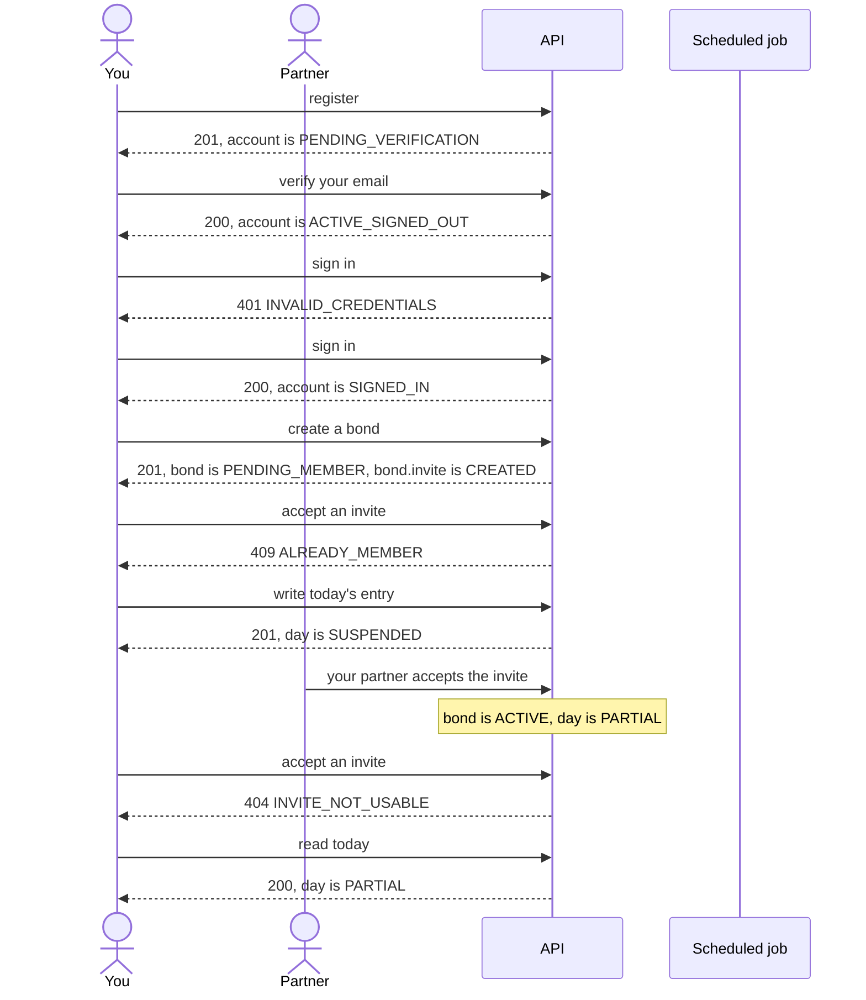
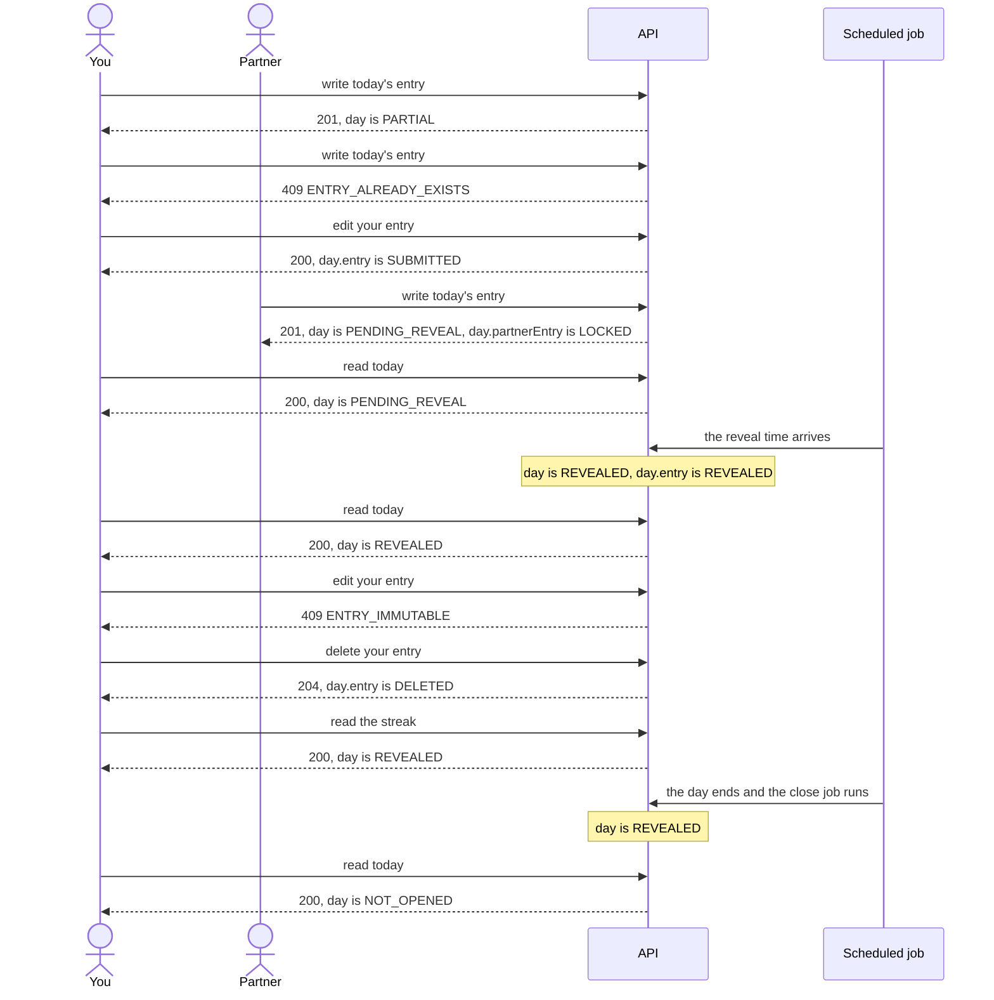
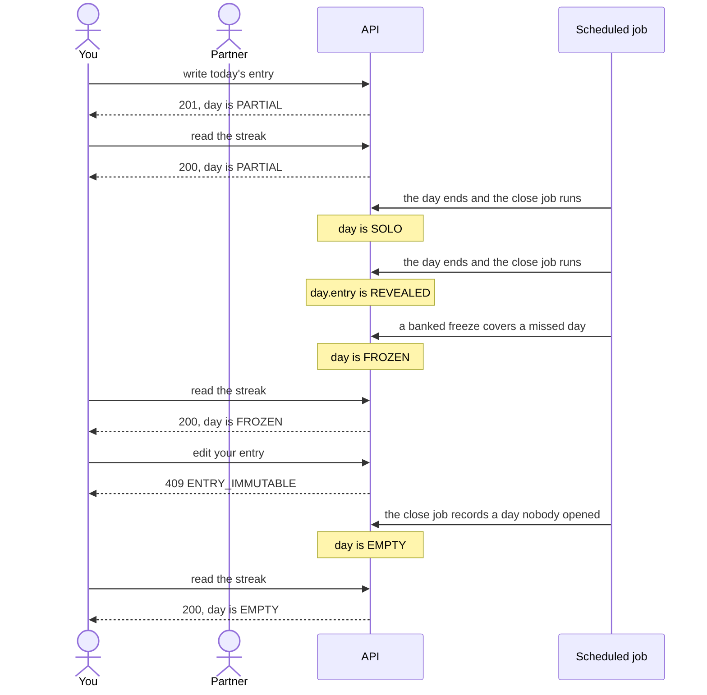
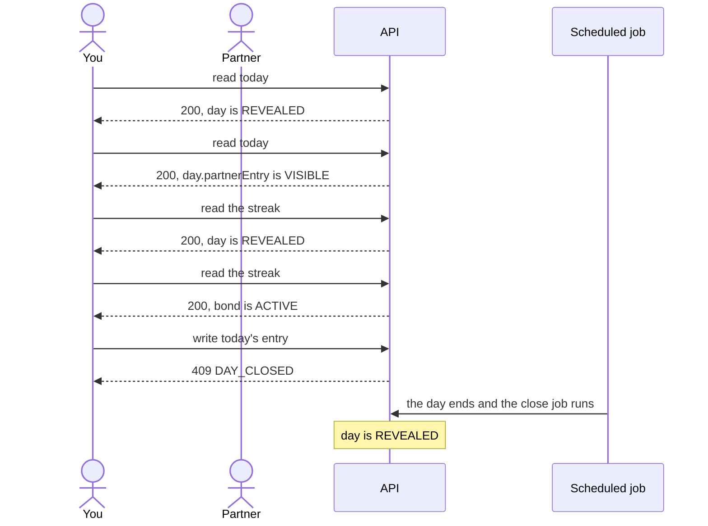
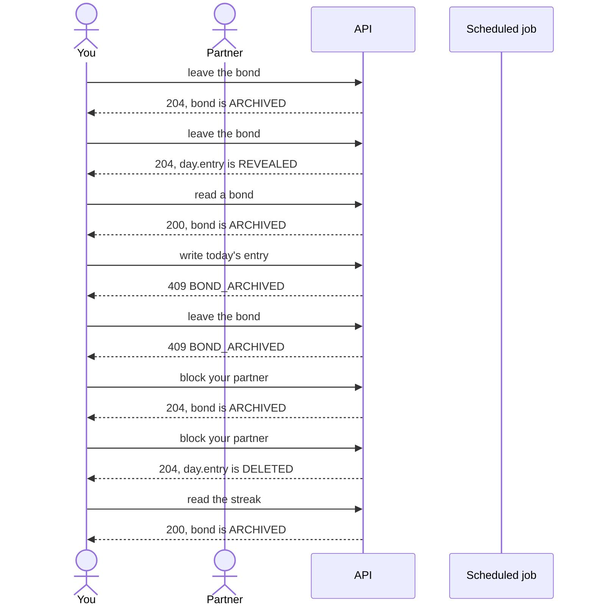

<!-- Generated by scripts/state-map-generate from docs/state-map/data. Do not edit. -->

# Journeys

Describes `main @ 174b474`. Each journey is a path through the three machines, taken from doc 02. How to read this: [README](README.md).

## J1: First run and pairing

1. **you**: register. The account is created PENDING_VERIFICATION, with its password hash and three consent rows, and a verification link good for 24 hours is emailed after the commit. The answer is 201 with an empty body and says nothing about the account. You are not signed in by registering.
2. **you**: verify your email. The link is spent, the address is marked verified and the account becomes ACTIVE. Any other live link of this account is deleted in the same transaction. The answer is 200 with an empty body; verifying does not sign you in.
3. **you**: sign in. One refusal covers a wrong password, an unknown address and a locked account, with a byte-identical body and no WWW-Authenticate, so that the answer does not say which it was. The failure is counted: the fifth in a row locks the account for one minute, and each failure after a lock has run out doubles the next lock, up to one hour. A first try, with the password mistyped.
4. **you**: sign in. You are signed in: a new session begins, and the answer carries an access token good for 15 minutes (expiresIn 900), a refresh token good for 30 days, and the profile. The count of failed attempts is cleared.
5. **you**: create a bond. A new bond is created with you as its owner, waiting for its second member, and with its first invite. It starts PENDING_MEMBER, not ACTIVE: nothing counts toward a streak until somebody joins. The request carries the bond's name, its kind and its anchor time zone, and here a reveal time as well, which is optional.
6. (the same request) **you**: create a bond. A bond is created together with its first invite, in one transaction: a six-character code, good for seven days and for one use. The response carries the code and its link.
7. **you**: accept an invite. The creator sending their own code. It is named, because it is a fact about you, and the code stays live for the person it was meant for.
8. **you**: write today's entry. The creator may write before the invitee joins. This write opens the day's row, and opens it SUSPENDED: private, and never counted by the streak. You do not wait for your partner.
9. **partner**: your partner accepts the invite. Somebody accepts your invite. The bond is two people and ACTIVE from that instant, and the code is spent. Later the same day. Your partner has registered, verified and signed in on their own device, as you did.
10. (the same request) **partner**: your partner accepts the invite. What the creator wrote while waiting counts from the pairing on: the joining day resumes with one entry, locked to the member who has just joined. A joining day left with both entries on it by the first build of this slice resumes straight to REVEALED or PENDING_REVEAL; nothing the current code writes can be in that state.
11. **you**: accept an invite. The code was used, by you or by somebody else: an invite works once. The one answer, identical to a code that never existed. You try the code once more, after your partner has used it.
12. **you**: read today. One of you has written. The status is shared on purpose, so a member who has not written can tell that their partner has. Both of you are now on day one, and your entry is waiting for theirs.

## J2: The daily loop

1. **you**: write today's entry. Yours is the first entry of the day, and this write is what opens the day's row. The row is inserted OPEN and counted to PARTIAL in the same transaction, so OPEN is never what this write commits. Your partner sees that you wrote, and nothing of what you wrote.
2. **you**: write today's entry. One entry per member per day. The database's unique index refuses the second; the first is untouched.
3. **you**: edit your entry. Nobody else has been entitled to read it yet, so the text is replaced. Only the text can change.
4. **partner**: write today's entry. You had written and your partner's entry is the second, but the bond's reveal time has not come. Later the same day.
5. (the same request) **partner**: write today's entry. Your partner has written. Until the reveal you are shown who wrote and nothing else.
6. **you**: read today. Both of you have written and the bond's reveal time has not come. Each sees their own entry in full and the other's locked.
7. **system**: the reveal time arrives. Nothing watches the clock for one day. The close job looks at every day waiting on a reveal time on each run and reveals those whose time has come, so the reveal lands up to a quarter of an hour after the time set. No request does this, not even GET /today.
8. (the same request) **system**: the reveal time arrives. Both entries of a day that was waiting are stamped revealed together, by the close job's first run after the time.
9. **you**: read today. Both entries are readable by both of you, and today is counted in the streak the response carries.
10. **you**: edit your entry. Your partner may already have read these words, so they can no longer be changed. You can still delete the entry.
11. **you**: delete your entry. The words are erased for both of you; your partner is left a tombstone. The reveal stamp is kept and the day stays as it was. You take the words back instead.
12. **you**: read the streak. The day is a COMPLETE square. While it is today it is added to the run at read time, provided the day before has been evaluated; after midnight the close job evaluates it and stores the same number.
13. **system**: the day ends and the close job runs. A day revealed while it was running is stamped closed and nothing else about it changes. That night.
14. **you**: read today. The response says OPEN with both entries null: what the day would open as. Reading opens nothing; that no row is written is asserted by a separate test, not by the one cited. The next morning. This is a new day, so nothing of yesterday's carries over, and the loop begins again.

## J3: The broken streak

1. **you**: write today's entry. Yours is the first entry of the day, and this write is what opens the day's row. The row is inserted OPEN and counted to PARTIAL in the same transaction, so OPEN is never what this write commits. Your partner sees that you wrote, and nothing of what you wrote.
2. **you**: read the streak. Today's square still says OPEN: the calendar never says who has written so far. One entry adds nothing to the run.
3. **system**: the day ends and the close job runs. The day ended with one entry, so it closes as a solo day. Your partner never wrote.
4. **system**: the day ends and the close job runs. A lone entry is unlocked to the partner who did not write when the day closes SOLO. The same moment, as your entry sees it.
5. **system**: a banked freeze covers a missed day. A missed day spends a banked freeze when Strict mode is off and there is a run to save. This is the one change evaluation makes to a closed day's status. The lone entry stays revealed. One freeze was banked.
6. **you**: read the streak. A rest day: a freeze covered it, or a zone change stepped over the date. It is a FROZEN square and it keeps the run going. The next morning.
7. **you**: edit your entry. Your partner may already have read these words, so they can no longer be changed. You can still delete the entry. You try to change what you wrote yesterday.
8. **system**: the close job records a day nobody opened. Nobody wrote, so the day never had a row. Once it has ended the close job writes one, already closed as EMPTY. That includes a day on which the bond ended or began a countdown: it began while the bond took entries. A day from before the pairing, or one that began after the bond ended, is never written and stays without a row. That day neither of you writes.
9. **you**: read the streak. Once the close job has evaluated it, a day nobody wrote on is a MISSED square and is not in the run. It has no square if it moved nothing: missed after the bond had ended, or during a deletion countdown since called off. The morning after. No freeze is left to cover the day, so the run ends here.

## J4: Looking back

1. **you**: read today. Both entries are readable by both of you, and today is counted in the streak the response carries. Both of you wrote today and the day has been revealed.
2. **you**: read today. The entry has been revealed, so you read it in full. What decides this is the entry's own reveal stamp, never the day's status. The same request, for your partner's entry.
3. **you**: read the streak. The day is a COMPLETE square. While it is today it is added to the run at read time, provided the day before has been evaluated; after midnight the close job evaluates it and stores the same number.
4. **you**: read the streak. The streak and a calendar from the day the bond became two people. Today is always on it, OPEN until both have written. The same request, as the bond sees it.
5. **you**: write today's entry. A revealed day is settled: its words have been read. The day is checked before the entry is inserted, so this is the answer whether you still have an entry on it or deleted yours, which is what stops delete-then-rewrite replacing words already read. You try to add to a day that is already settled.
6. **system**: the day ends and the close job runs. A day revealed while it was running is stamped closed and nothing else about it changes. After this the day is no longer today, and the journey stops here, where the API does: the archive, favourites and search that would show the day again are not built.

## J5: Ending

1. **you**: leave the bond. One member leaving ends the bond for both: it becomes ARCHIVED, a record each of you can still read. Nobody is notified, and anything waiting to be agreed is cancelled. Your entries stay as they are unless the body says withdrawEntries: true, in which case they are taken back for both of you (ADR-0035 §11). You send no body, so your entries stay.
2. **you**: leave the bond. Your revealed entry stays readable to both of you, in a record neither can add to. You may still delete it yourself. The same request, as your entry sees it.
3. **you**: read a bond. An ended bond is a record both members keep. The member who left reads it too.
4. **you**: write today's entry. A bond that has ended takes no new entry, from either member. It is checked under the bond's lock and before the day is looked at, so nothing is stored and no day is opened.
5. **you**: leave the bond. A bond that has ended cannot be left again, by the member who left or the one who stayed. Nothing is withdrawn, whatever the body says. To take your entries back from an ended bond, block.
6. **you**: block your partner. Block is the one write an ended bond accepts, from the member who stayed or the one who left, and it may be repeated. It records the block once and changes nothing either of you can read: no status, no leftAt, no ETag. Your entries are taken back for both of you unless the body says withdrawEntries: false (ADR-0035 §11). You send no body, so your entries go.
7. **you**: block your partner. Your entries are taken back in the same transaction. From that commit yours reads as DELETED with no text, to both of you, though your partner had read it; the rows are erased afterwards, in seconds as a rule, and much later if the poller is stopped or a delivery is backing off. Your partner's own entries are untouched. The same request, as your entry sees it.
8. **you**: read the streak. An ended bond keeps the streak it had, and its calendar ends on the day the bond did, for both members.

