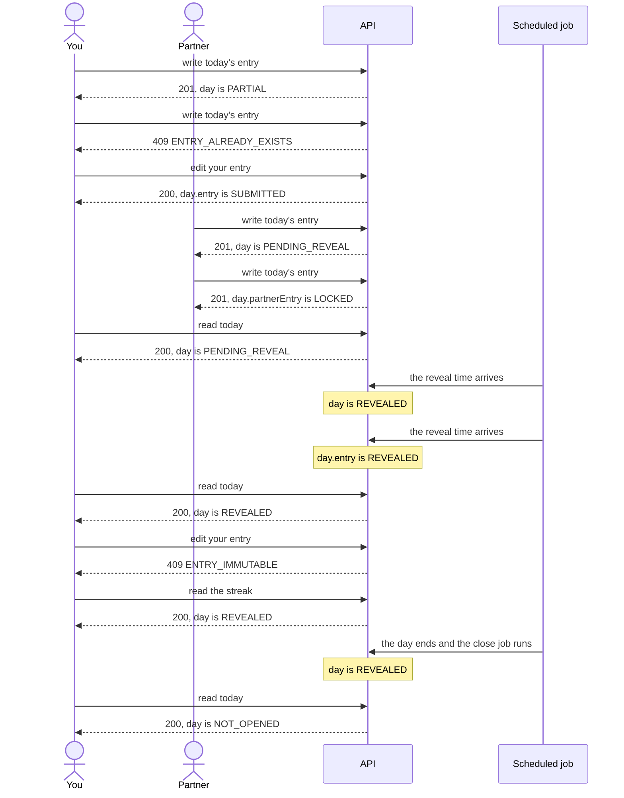

<!-- Generated by scripts/state-map-generate from docs/state-map/data. Do not edit. -->

# Journeys

Describes `main @ 174b474`. Each journey is a path through the three machines, taken from doc 02. How to read this: [README](README.md).

## J2: The daily loop

1. **you**: write today's entry. Yours is the first entry of the day, and this write is what opens the day's row. The row is inserted OPEN and counted to PARTIAL in the same transaction, so OPEN is never what this write commits. Your partner sees that you wrote, and nothing of what you wrote.
2. **you**: write today's entry. One entry per member per day. The database's unique index refuses the second; the first is untouched.
3. **you**: edit your entry. Nobody else has been entitled to read it yet, so the text is replaced. Only the text can change.
4. **partner**: write today's entry. You had written and your partner's entry is the second, but the bond's reveal time has not come. Later the same day.
5. **partner**: write today's entry. Your partner has written. Until the reveal you are shown who wrote and nothing else. The same request, as it changes what you see of their entry.
6. **you**: read today. Both of you have written and the bond's reveal time has not come. Each sees their own entry in full and the other's locked.
7. **system**: the reveal time arrives. Nothing watches the clock for one day. The close job looks at every day waiting on a reveal time on each run and reveals those whose time has come, so the reveal lands up to a quarter of an hour after the time set. No request does this, not even GET /today.
8. **system**: the reveal time arrives. Both entries of a day that was waiting are stamped revealed together, by the close job's first run after the time. The same moment, as your entry sees it.
9. **you**: read today. Both entries are readable by both of you, and today is counted in the streak the response carries.
10. **you**: edit your entry. Your partner may already have read these words, so they can no longer be changed. You can still delete the entry.
11. **you**: read the streak. The day is a COMPLETE square. While it is today it is added to the run at read time, provided the day before has been evaluated; after midnight the close job evaluates it and stores the same number.
12. **system**: the day ends and the close job runs. A day revealed while it was running is stamped closed and nothing else about it changes. That night.
13. **you**: read today. The response says OPEN with both entries null: what the day would open as. Reading opens nothing; that no row is written is asserted by a separate test, not by the one cited. The next morning. This is a new day, so nothing of yesterday's carries over, and the loop begins again.

